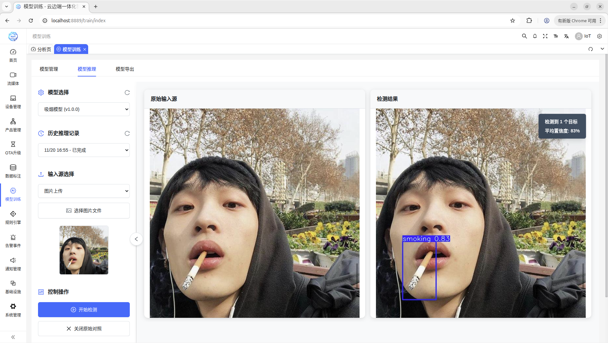

# EasyAIoT（云边端一体化智能算法应用平台）

我希望全世界都能使用这个系统，实现AI的真正0门槛，人人都能体验到AI带来的好处，而并不只是掌握在少数人手里。

    

<h4 align="center" style="display: flex; justify-content: center; gap: 20px; flex-wrap: wrap; padding: 20px; font-weight: bold;">
  <a href="./README.md">中文文档</a>
  |
  <a href="./README_en.md">English Document</a>
</h4>

## 🌟 关于项目的一些思考

### 📍 项目定位

EasyAIoT是一个云边端一体化的智能物联网平台，专注于AI与IoT的深度融合，实现从设备接入到数据采集、AI分析、智能决策的全链路闭环，真正实现万物互联、万物智控。

#### 🧠 AI能力

<ul style="font-size: 14px; line-height: 1.8; color: #444; margin: 10px 0;">
  <li>支持百级摄像头接入、采集、标注、训练、推理、导出、分析、告警、录像、存储、部署</li>
  <li>PaddleOCR文字识别、语音转文本</li>
  <li>多模态视觉大模型（物体识别、文字识别）</li>
  <li>LLM大语言模型（支持RTSP流、视频、图像、语音、文本等）</li>
</ul>

#### 🌐 IoT能力

<ul style="font-size: 14px; line-height: 1.8; color: #444; margin: 10px 0;">
  <li><strong>设备接入与管理</strong>：设备注册、认证、状态监控、生命周期管理</li>
  <li><strong>产品与物模型管理</strong>：产品定义、物模型配置、产品管理</li>
  <li><strong>多协议支持</strong>：MQTT、TCP、HTTP等多种物联网协议</li>
  <li><strong>设备认证与动态注册</strong>：安全接入、身份认证、动态设备注册</li>
  <li><strong>规则引擎</strong>：数据流转规则、消息路由、数据转换</li>
  <li><strong>数据采集与存储</strong>：设备数据采集、存储、查询与分析</li>
  <li><strong>设备状态监控与告警管理</strong>：实时监控、异常告警、智能决策</li>
</ul>

### 💡 技术理念

我认为没有任何一个编程语言是擅长所有事情，但如果是3种编程语言混合，EasyAIoT将所向披靡，恰好我具备这种特质。

Java适合做平台但不适合网络编程和AI编程，Python适合做网络和AI编程但不适合做高性能任务执行，C++适合做高性能任务执行但不适合做前面两者做的事情，EasyAIoT设想是采用三合一语言混编，构建一个实现不太Easy，但是使用非常Easy的AIoT平台。

### 🔄 模块数据流转

### 🤖 零样本标注技术

创新性的依托大模型构建零样本标注技术体系（理想状态去掉人工标注环节，标注完全解放人力），该技术通过大模型生成初始数据并借助提示词技术完成自动标注，再经人机协同校验确保数据质量（可选），进而训练出初始小模型。该小模型通过持续迭代、自我优化，实现标注效率与模型精度协同进化，最终推动系统性能不断攀升。

### 🏗️ 项目架构特点

EasyAIoT其实不是一个项目，而是五个项目。

好处是什么呢？假如说你在一个受限的设备上（比如RK3588），你只需要拿出其中某个项目就可以独立部署，所以看似这个项目是云平台，其实他也可以是边缘平台。

🌟 真开源不易，如果这个项目对您有帮助，请您点亮一颗Star再离开，这将是对我最大的支持！ 
<small style="font-size: 14px; opacity: 0.9;">（在这个假开源横行的时代，这个项目就是一个异类，纯靠爱来发电）</small>

## 🎯 适用场景

## 🧩 项目结构

EasyAIoT由五个核心项目组成：

<table style="width: 100%; border-collapse: collapse; margin: 20px 0; font-size: 14px;">
<tr>
<td style="padding: 15px; border: 1px solid #e0e0e0; background-color: #f8f9fa; font-weight: 600; color: #2c3e50; width: 20%;">模块</td>
<td style="padding: 15px; border: 1px solid #e0e0e0; background-color: #f8f9fa; font-weight: 600; color: #2c3e50;">描述</td>
</tr>
<tr>
<td style="padding: 15px; border: 1px solid #e0e0e0; vertical-align: top;"><strong>WEB模块</strong></td>
<td style="padding: 15px; border: 1px solid #e0e0e0; line-height: 1.8; color: #444;">基于Vue的前端管理界面，提供统一的用户交互体验</td>
</tr>
<tr>
<td style="padding: 15px; border: 1px solid #e0e0e0; vertical-align: top;"><strong>DEVICE模块</strong></td>
<td style="padding: 15px; border: 1px solid #e0e0e0; line-height: 1.8; color: #444;">
  <ul style="margin: 5px 0; padding-left: 20px;">
    <li><strong>技术优势</strong>：基于JDK21，提供更好的性能和现代化特性</li>
    <li><strong>设备管理</strong>：设备注册、认证、状态监控、生命周期管理</li>
    <li><strong>产品管理</strong>：产品定义、物模型管理、产品配置</li>
    <li><strong>协议支持</strong>：MQTT、TCP、HTTP等多种物联网协议</li>
    <li><strong>设备认证</strong>：设备动态注册、身份认证、安全接入</li>
    <li><strong>规则引擎</strong>：数据流转规则、消息路由、数据转换</li>
    <li><strong>数据采集</strong>：设备数据采集、存储、查询与分析</li>
  </ul>
</td>
</tr>
<tr>
<td style="padding: 15px; border: 1px solid #e0e0e0; vertical-align: top;"><strong>VIDEO模块</strong></td>
<td style="padding: 15px; border: 1px solid #e0e0e0; line-height: 1.8; color: #444;">基于Python的视频处理模块，负责视频流处理与传输</td>
</tr>
<tr>
<td style="padding: 15px; border: 1px solid #e0e0e0; vertical-align: top;"><strong>AI模块</strong></td>
<td style="padding: 15px; border: 1px solid #e0e0e0; line-height: 1.8; color: #444;">基于Python的人工智能处理模块，负责视频分析和AI算法执行</td>
</tr>
<tr>
<td style="padding: 15px; border: 1px solid #e0e0e0; vertical-align: top;"><strong>TASK模块</strong></td>
<td style="padding: 15px; border: 1px solid #e0e0e0; line-height: 1.8; color: #444;">基于C++的高性能任务处理模块，负责计算密集型任务执行</td>
</tr>
</table>

## 🖥️ 跨平台部署优势

EasyAIoT支持在Linux、Mac、Windows三大主流操作系统上部署，为不同环境下的用户提供灵活便捷的部署方案：

<h4 style="margin-top: 0; color: white; font-size: 18px;">🐧 Linux部署优势</h4>
<ul style="font-size: 14px; line-height: 1.8; margin: 10px 0; padding-left: 20px;">
  <li>适合生产环境，稳定可靠，资源占用低</li>
  <li>支持Docker容器化部署，一键启动所有服务</li>
  <li>完美适配服务器、边缘计算设备（如RK3588等ARM架构设备）</li>
  <li>提供完整的自动化安装脚本，简化部署流程</li>
</ul>

<h4 style="margin-top: 0; color: white; font-size: 18px;">🍎 Mac部署优势</h4>
<ul style="font-size: 14px; line-height: 1.8; margin: 10px 0; padding-left: 20px;">
  <li>适合开发测试环境，与macOS系统深度集成</li>
  <li>支持本地开发和调试，快速验证功能</li>
  <li>提供便捷的安装脚本，支持Homebrew等包管理器</li>
</ul>

<h4 style="margin-top: 0; color: white; font-size: 18px;">🪟 Windows部署优势</h4>
<ul style="font-size: 14px; line-height: 1.8; margin: 10px 0; padding-left: 20px;">
  <li>适合Windows服务器环境，降低学习成本</li>
  <li>支持PowerShell自动化脚本，简化部署操作</li>
  <li>兼容Windows Server和桌面版Windows系统</li>
  <li>提供图形化安装向导，用户友好</li>
</ul>

<strong>统一体验</strong>：无论选择哪种操作系统，EasyAIoT都提供一致的安装脚本和部署文档，确保跨平台部署体验的一致性。

## ☁️ EasyAIoT = AI + IoT = 云边一体化解决方案

支持上千种垂直场景，支持AI模型定制化和AI算法定制化开发，深度融合。

<h3 style="color: #2c3e50; margin-top: 0;">赋能万物智视：EasyAIoT</h3>

构筑了物联网设备（尤其是海量摄像头）的高效接入与管控网络。我们深度融合流媒体实时传输技术与前沿人工智能（AI），打造一体化服务核心。这套方案不仅打通了异构设备的互联互通，更将高清视频流与强大的AI解析引擎深度集成，赋予监控系统"智能之眼"——精准实现人脸识别、异常行为分析、风险人员布控及周界入侵检测。

在物联网设备管理方面，EasyAIoT提供完整的设备生命周期管理能力，支持多种物联网协议（MQTT、TCP、HTTP），实现设备的快速接入、安全认证、实时监控和智能控制。通过规则引擎实现设备数据的智能流转与处理，结合AI能力对设备数据进行深度分析，实现从设备接入、数据采集、智能分析到决策执行的全流程自动化，真正实现万物互联、万物智控。

## ⚠️ 免责声明

EasyAIoT是一个开源学习项目，与商业行为无关。用户在使用该项目时，应遵循法律法规，不得进行非法活动。如果EasyAIoT发现用户有违法行为，将会配合相关机关进行调查并向政府部门举报。用户因非法行为造成的任何法律责任均由用户自行承担，如因用户使用造成第三方损害的，用户应当依法予以赔偿。使用EasyAIoT所有相关资源均由用户自行承担风险.

## 📚 部署文档

- [平台部署文档](.doc/部署文档/平台部署文档.md)

## 🎮 演示环境

- 演示地址：http://36.111.47.113:8888/
- 账号：admin
- 密码：admin123

## ⚙️ 项目地址

- Gitee: https://gitee.com/soaring-xiongkulu/easyaiot
- Github: https://github.com/soaring-xiongkulu/easyaiot

## 📸 截图

  
  

  
  

  
  

  
  

  
  

  
  

  
  

  
  

  
  

  
  

  
  

  
  

  
  

  
  

  
  

  
  

  
  

  
  

  
  

  
  

  
  

  
  

  
  

  
  

  
  

## 🛠️ 服务支持

我们提供了各种服务方式帮助您深入了解EasyAIoT平台和代码，通过产品文档、技术交流群、付费教学等方式，你将获得如下服务：

<table style="width: 100%; border-collapse: collapse; margin: 20px 0; font-size: 14px; box-shadow: 0 2px 8px rgba(0,0,0,0.1);">
<thead>
<tr style="background: linear-gradient(135deg, #667eea 0%, #764ba2 100%); color: white;">
<th style="padding: 15px; text-align: left; font-weight: 600;">服务项</th>
<th style="padding: 15px; text-align: left; font-weight: 600;">服务内容</th>
<th style="padding: 15px; text-align: center; font-weight: 600;">服务收费</th>
<th style="padding: 15px; text-align: left; font-weight: 600;">服务方式</th>
</tr>
</thead>
<tbody>
<tr style="background-color: #f8f9fa;">
<td style="padding: 15px; border: 1px solid #e0e0e0; font-weight: 600; color: #2c3e50;">系统部署</td>
<td style="padding: 15px; border: 1px solid #e0e0e0; color: #444;">在客户指定的网络和硬件环境中完成EasyAIoT部署</td>
<td style="padding: 15px; border: 1px solid #e0e0e0; text-align: center; color: #e74c3c; font-weight: 600;">500元</td>
<td style="padding: 15px; border: 1px solid #e0e0e0; color: #444;">线上部署支持</td>
</tr>
<tr>
<td style="padding: 15px; border: 1px solid #e0e0e0; font-weight: 600; color: #2c3e50;">技术支持</td>
<td style="padding: 15px; border: 1px solid #e0e0e0; color: #444;">提供各类部署、功能使用中遇到的问题答疑</td>
<td style="padding: 15px; border: 1px solid #e0e0e0; text-align: center; color: #e74c3c; font-weight: 600;">200元</td>
<td style="padding: 15px; border: 1px solid #e0e0e0; color: #444;">半小时内 线上远程支持</td>
</tr>
<tr style="background-color: #f8f9fa;">
<td style="padding: 15px; border: 1px solid #e0e0e0; font-weight: 600; color: #2c3e50;">模型训练</td>
<td style="padding: 15px; border: 1px solid #e0e0e0; color: #444;">训练业务场景识别模型</td>
<td style="padding: 15px; border: 1px solid #e0e0e0; text-align: center; color: #e74c3c; font-weight: 600;">1000+元</td>
<td style="padding: 15px; border: 1px solid #e0e0e0; color: #444;">模型定制化训练</td>
</tr>
<tr>
<td style="padding: 15px; border: 1px solid #e0e0e0; font-weight: 600; color: #2c3e50;">其他服务</td>
<td style="padding: 15px; border: 1px solid #e0e0e0; color: #444;">垂直领域解决方案定制化开发；定制化时长、功能服务等</td>
<td style="padding: 15px; border: 1px solid #e0e0e0; text-align: center; color: #e74c3c; font-weight: 600;">面议</td>
<td style="padding: 15px; border: 1px solid #e0e0e0; color: #444;">面议</td>
</tr>
</tbody>
</table>

## 📞 联系方式（添加微信后，需关注公众号，拉入技术交流群）

  

## 👥 公众号

  

## 🪐 知识星球：

  

## 💰 打赏赞助

    
    

## 🙏 致谢

感谢以下各位对本项目包括但不限于代码贡献、问题反馈、资金捐赠等各种方式的支持！以下排名不分先后：
<table>
  <tbody>
    <tr>
      <td align="center" valign="top" width="11.11%"><a href="https://gitee.com/bcake" target="_blank"> <b>大饼</b></a></td>
      <td align="center" valign="top" width="11.11%"><a href="https://gitee.com/jiang4yu" target="_blank"> <b>山寒</b></a></td>
      <td align="center" valign="top" width="11.11%"><a href="https://gitee.com/baobaomo" target="_blank"> <b>放学丶别走</b></a></td>
      <td align="center" valign="top" width="11.11%"><a href="https://gitee.com/wagger" target="_blank"> <b>春和</b></a></td>
      <td align="center" valign="top" width="11.11%"><a href="https://gitee.com/longbinwu" target="_blank"> <b>章鱼小丸子</b></a></td>
      <td align="center" valign="top" width="11.11%"><a href="javascript:void(0)" target="_blank"> <b>Catwings</b></a></td>
      <td align="center" valign="top" width="11.11%"><a href="javascript:void(0)" target="_blank"> <b>小工头</b></a></td>
      <td align="center" valign="top" width="11.11%"><a href="javascript:void(0)" target="_blank"> <b>西乡一粒沙</b></a></td>
      <td align="center" valign="top" width="11.11%"><a href="https://gitee.com/L_Z_M" target="_blank"> <b>玖零。</b></a></td>
    </tr>
    <tr>
      <td align="center" valign="top" width="11.11%"><a href="https://gitee.com/36436022" target="_blank"> <b>金鸿伟</b></a></td>
      <td align="center" valign="top" width="11.11%"><a href="https://gitee.com/cnlijf" target="_blank"> <b>李江峰</b></a></td>
      <td align="center" valign="top" width="11.11%"><a href="javascript:void(0)" target="_blank"> <b>Best Yao</b></a></td>
      <td align="center" valign="top" width="11.11%"><a href="https://gitee.com/weiloser" target="_blank"> <b>无为而治</b></a></td>
      <td align="center" valign="top" width="11.11%"><a href="https://gitee.com/shup092_admin" target="_blank"> <b>shup</b></a></td>
      <td align="center" valign="top" width="11.11%"><a href="https://gitee.com/gampa" target="_blank"> <b>也许</b></a></td>
      <td align="center" valign="top" width="11.11%"><a href="https://gitee.com/leishaozhuanshudi" target="_blank"> <b>⁰ʚᦔrꫀꪖꪑ⁰ɞ .</b></a></td>
      <td align="center" valign="top" width="11.11%"><a href="https://gitee.com/fateson" target="_blank"> <b>逆</b></a></td>
      <td align="center" valign="top" width="11.11%"><a href="https://gitee.com/dongGezzz_admin" target="_blank"> <b>廖东旺</b></a></td>
    </tr>
    <tr>
      <td align="center" valign="top" width="11.11%"><a href="https://gitee.com/huangzhen1993" target="_blank"> <b>黄振</b></a></td>
      <td align="center" valign="top" width="11.11%"><a href="https://github.com/fengchunshen" target="_blank"> <b>春生</b></a></td>
      <td align="center" valign="top" width="11.11%"><a href="https://gitee.com/mrfox_wang" target="_blank"> <b>贵阳王老板</b></a></td>
      <td align="center" valign="top" width="11.11%"><a href="https://gitee.com/haobaby" target="_blank"> <b>hao_chen</b></a></td>
      <td align="center" valign="top" width="11.11%"><a href="https://gitee.com/finalice" target="_blank"> <b>尽千</b></a></td>
      <td align="center" valign="top" width="11.11%"><a href="https://gitee.com/yuer629" target="_blank"> <b>yuer629</b></a></td>
      <td align="center" valign="top" width="11.11%"><a href="https://gitee.com/cai-peikai/ai-project" target="_blank"> <b>kong</b></a></td>
      <td align="center" valign="top" width="11.11%"><a href="https://gitee.com/HB1731276584" target="_blank"> <b>岁月静好</b></a></td>
      <td align="center" valign="top" width="11.11%"><a href="https://gitee.com/hy5128" target="_blank"> <b>Kunkka</b></a></td>
    </tr>
    <tr>
      <td align="center" valign="top" width="11.11%"><a href="https://gitee.com/guo-dida" target="_blank"> <b>灬</b></a></td>
      <td align="center" valign="top" width="11.11%"><a href="https://github.com/XyhBill" target="_blank"> <b>Mr.LuCkY</b></a></td>
      <td align="center" valign="top" width="11.11%"><a href="https://gitee.com/timeforeverz" target="_blank"> <b>泓</b></a></td>
      <td align="center" valign="top" width="11.11%"><a href="https://gitee.com/mySia" target="_blank"> <b>i</b></a></td>
      <td align="center" valign="top" width="11.11%"><a href="javascript:void(0)" target="_blank"> <b>依依</b></a></td>
      <td align="center" valign="top" width="11.11%"><a href="https://gitee.com/sunbirder" target="_blank"> <b>小菜鸟先飞</b></a></td>
      <td align="center" valign="top" width="11.11%"><a href="https://gitee.com/mmy0" target="_blank"> <b>追溯未来</b></a></td>
      <td align="center" valign="top" width="11.11%"><a href="https://gitee.com/ccqingshan" target="_blank"> <b>青衫</b></a></td>
      <td align="center" valign="top" width="11.11%"><a href="https://gitee.com/jiangchunJava" target="_blank"> <b>Fae</b></a></td>
    </tr>
    <tr>
      <td align="center" valign="top" width="11.11%"><a href="https://gitee.com/huang-xiangtai" target="_blank"> <b>憨憨</b></a></td>
      <td align="center" valign="top" width="11.11%"><a href="https://gitee.com/gu-beichen-starlight" target="_blank"> <b>文艺小青年</b></a></td>
      <td align="center" valign="top" width="11.11%"><a href="https://github.com/zhangnanchao" target="_blank"> <b>lion</b></a></td>
      <td align="center" valign="top" width="11.11%"><a href="https://gitee.com/yupccc" target="_blank"> <b>汪汪队立大功</b></a></td>
      <td align="center" valign="top" width="11.11%"><a href="https://gitee.com/wcjjjjjjj" target="_blank"> <b>wcj</b></a></td>
      <td align="center" valign="top" width="11.11%"><a href="https://gitee.com/hufanglei" target="_blank"> <b>怒放de生命</b></a></td>
      <td align="center" valign="top" width="11.11%"><a href="https://gitee.com/juyunsuan" target="_blank"> <b>蓝速传媒</b></a></td>
      <td align="center" valign="top" width="11.11%"><a href="https://gitee.com/achieve275" target="_blank"> <b>Achieve_Xu</b></a></td>
      <td align="center" valign="top" width="11.11%"><a href="https://gitee.com/nicholasld" target="_blank"> <b>NicholasLD</b></a></td>
    </tr>
    <tr>
      <td align="center" valign="top" width="11.11%"><a href="https://gitee.com/ADVISORYZ" target="_blank"> <b>ADVISORYZ</b></a></td>
      <td align="center" valign="top" width="11.11%"><a href="https://gitee.com/dongxinji" target="_blank"> <b>take your time or</b></a></td>
      <td align="center" valign="top" width="11.11%"><a href="https://github.com/xu756" target="_blank"> <b>碎碎念.</b></a></td>
      <td align="center" valign="top" width="11.11%"><a href="https://gitee.com/lwisme" target="_blank"> <b>北街</b></a></td>
      <td align="center" valign="top" width="11.11%"><a href="https://gitee.com/yu-xinyan71" target="_blank"> <b>Dorky TAT</b></a></td>
      <td align="center" valign="top" width="11.11%"><a href="https://gitee.com/chenxiaohong" target="_blank"> <b>右耳向西</b></a></td>
      <td align="center" valign="top" width="11.11%"><a href="https://github.com/派大星" target="_blank"> <b>派大星</b></a></td>
      <td align="center" valign="top" width="11.11%"><a href="https://gitee.com/wz_vue_gitee_181" target="_blank"> <b>棒槌</b></a></td>
      <td align="center" valign="top" width="11.11%"><a href="https://gitee.com/nctwo" target="_blank"> <b>信微输传助手</b></a></td>
    </tr>
    <tr>
      <td align="center" valign="top" width="11.11%"><a href="https://gitee.com/l9999_admin" target="_blank"> <benen>一往无前</benen></a></td>
      <td align="center" valign="top" width="11.11%"><a href="https://gitee.com/stenin" target="_blank"> <b>Charon</b></a></td>
      <td align="center" valign="top" width="11.11%"><a href="https://gitee.com/zhao-yihuiwifi" target="_blank"> <b>赵WIFI.</b></a></td>
      <td align="center" valign="top" width="11.11%"><a href="https://gitee.com/Yang619" target="_blank"> <b>Chao.</b></a></td>
      <td align="center" valign="top" width="11.11%"><a href="https://gitee.com/lcrsd123" target="_blank"> <b>城市稻草人</b></a></td>
      <td align="center" valign="top" width="11.11%"><a href="https://gitee.com/Mo_bai1016" target="_blank"> <b>Bug写手墨白</b></a></td>
      <td align="center" valign="top" width="11.11%"><a href="https://gitee.com/kevinosc_admin" target="_blank"> <b>kevin</b></a></td>
      <td align="center" valign="top" width="11.11%"><a href="https://gitee.com/lhyicn" target="_blank"> <b>童年</b></a></td>
      <td align="center" valign="top" width="11.11%"><a href="https://gitee.com/dubai100" target="_blank"> <b>sherry金</b></a></td>
    </tr>
    <tr>
        <td align="center" valign="top" width="11.11%"><a href="javascript:void(0)" target="_blank"> <b>℡夏别</b></a></td>
        <td align="center" valign="top" width="11.11%"><a href="javascript:void(0)" target="_blank"> <b>翠翠草原</b></a></td>
        <td align="center" valign="top" width="11.11%"><a href="javascript:void(0)" target="_blank"> <b>慕容曦</b></a></td>
        <td align="center" valign="top" width="11.11%"><a href="javascript:void(0)" target="_blank"> <b>Tyrion</b></a></td>
        <td align="center" valign="top" width="11.11%"><a href="javascript:void(0)" target="_blank"> <b>大漠孤烟</b></a></td>
        <td align="center" valign="top" width="11.11%"><a href="javascript:void(0)" target="_blank"> <b>Return</b></a></td>
        <td align="center" valign="top" width="11.11%"><a href="javascript:void(0)" target="_blank"> <b>一杯拿铁</b></a></td>
        <td align="center" valign="top" width="11.11%"><a href="javascript:void(0)" target="_blank"> <b>Thuri</b></a></td>
        <td align="center" valign="top" width="11.11%"><a href="javascript:void(0)" target="_blank"> <b>Liu</b></a></td>
    </tr>
    <tr>
        <td align="center" valign="top" width="11.11%"><a href="javascript:void(0)" target="_blank"> <b>三金</b></a></td>
        <td align="center" valign="top" width="11.11%"><a href="javascript:void(0)" target="_blank"> <b>ZPort</b></a></td>
        <td align="center" valign="top" width="11.11%"><a href="javascript:void(0)" target="_blank"> <b>Li</b></a></td>
        <td align="center" valign="top" width="11.11%"><a href="javascript:void(0)" target="_blank"> <b>嘉树</b></a></td>
        <td align="center" valign="top" width="11.11%"><a href="javascript:void(0)" target="_blank"> <b>俊采星驰</b></a></td>
        <td align="center" valign="top" width="11.11%"><a href="javascript:void(0)" target="_blank"> <b>oi</b></a></td>
        <td align="center" valign="top" width="11.11%"><a href="javascript:void(0)" target="_blank"> <b>ZhangY_000</b></a></td>
        <td align="center" valign="top" width="11.11%"><a href="javascript:void(0)" target="_blank"> <b>℡夏别</b></a></td>
        <td align="center" valign="top" width="11.11%"><a href="javascript:void(0)" target="_blank"> <b>张瑞麟</b></a></td>
    </tr>
    <tr>
        <td align="center" valign="top" width="11.11%"><a href="javascript:void(0)" target="_blank"> <b>Lion King</b></a></td>
        <td align="center" valign="top" width="11.11%"><a href="javascript:void(0)" target="_blank"> <b>Frank</b></a></td>
        <td align="center" valign="top" width="11.11%"><a href="javascript:void(0)" target="_blank"> <b>徐梦阳</b></a></td>
        <td align="center" valign="top" width="11.11%"><a href="javascript:void(0)" target="_blank"> <b>九月</b></a></td>
        <td align="center" valign="top" width="11.11%"><a href="javascript:void(0)" target="_blank"> <b>tangl伟</b></a></td>
        <td align="center" valign="top" width="11.11%"><a href="javascript:void(0)" target="_blank"> <b>冯瑞伦</b></a></td>
        <td align="center" valign="top" width="11.11%"><a href="javascript:void(0)" target="_blank"> <b>杨林</b></a></td>
        <td align="center" valign="top" width="11.11%"><a href="javascript:void(0)" target="_blank"> <b>梧桐有语。</b></a></td>
        <td align="center" valign="top" width="11.11%"><a href="javascript:void(0)" target="_blank"> <b>歌德de花烛</b></a></td>
    </tr>
    <tr>
        <td align="center" valign="top" width="11.11%"><a href="javascript:void(0)" target="_blank"> <b>泥嚎</b></a></td>
        <td align="center" valign="top" width="11.11%"><a href="javascript:void(0)" target="_blank"> <b>翠翠草原</b></a></td>
        <td align="center" valign="top" width="11.11%"><a href="javascript:void(0)" target="_blank"> <b>胡泽龙</b></a></td>
        <td align="center" valign="top" width="11.11%"><a href="javascript:void(0)" target="_blank"> <b>苏叶</b></a></td>
        <td align="center" valign="top" width="11.11%"><a href="javascript:void(0)" target="_blank"> <b>裴先生</b></a></td>
        <td align="center" valign="top" width="11.11%"><a href="javascript:void(0)" target="_blank"> <b>谭远彪</b></a></td>
        <td align="center" valign="top" width="11.11%"><a href="javascript:void(0)" target="_blank"> <b>陈祺</b></a></td>
        <td align="center" valign="top" width="11.11%"><a href="javascript:void(0)" target="_blank"> <b>零点就睡</b></a></td>
        <td align="center" valign="top" width="11.11%"><a href="javascript:void(0)" target="_blank"> <b>风之羽</b></a></td>
    </tr>
    <tr>
        <td align="center" valign="top" width="11.11%"><a href="https://gitee.com/fufeng1908" target="_blank"> <b>王守仁</b></a></td>
        <td align="center" valign="top" width="11.11%"><a href="https://gitee.com/kaigejava" target="_blank"> <b>狼图腾</b></a></td>
        <td align="center" valign="top" width="11.11%"><a href="javascript:void(0)" target="_blank"> <b>马到成功</b></a></td>
        <td align="center" valign="top" width="11.11%"><a href="javascript:void(0)" target="_blank"> <b>做生活的高手</b></a></td>
        <td align="center" valign="top" width="11.11%"><a href="javascript:void(0)" target="_blank"> <b>清欢之恋</b></a></td>
        <td align="center" valign="top" width="11.11%"><a href="javascript:void(0)" target="_blank"> <b>绝域时空</b></a></td>
        <td align="center" valign="top" width="11.11%"><a href="javascript:void(0)" target="_blank"> <b>风雨</b></a></td>
        <td align="center" valign="top" width="11.11%"><a href="javascript:void(0)" target="_blank"> <b>Nicola</b></a></td>
        <td align="center" valign="top" width="11.11%"><a href="javascript:void(0)" target="_blank"> <b>云住</b></a></td>
    </tr>
    <tr>
        <td align="center" valign="top" width="11.11%"><a href="javascript:void(0)" target="_blank"> <b>Mr.Zhang</b></a></td>
        <td align="center" valign="top" width="11.11%"><a href="javascript:void(0)" target="_blank"> <b>剑</b></a></td>
        <td align="center" valign="top" width="11.11%"><a href="javascript:void(0)" target="_blank"> <b>shen</b></a></td>
        <td align="center" valign="top" width="11.11%"><a href="javascript:void(0)" target="_blank"> <b>嗯</b></a></td>
        <td align="center" valign="top" width="11.11%"><a href="javascript:void(0)" target="_blank"> <b>周华</b></a></td>
        <td align="center" valign="top" width="11.11%"><a href="javascript:void(0)" target="_blank"> <b>太阳鸟</b></a></td>
        <td align="center" valign="top" width="11.11%"><a href="javascript:void(0)" target="_blank"> <b>了了</b></a></td>
        <td align="center" valign="top" width="11.11%"><a href="javascript:void(0)" target="_blank"> <b>第七次日落</b></a></td>
        <td align="center" valign="top" width="11.11%"><a href="javascript:void(0)" target="_blank"> <b>npc</b></a></td>
    </tr>
    <tr>
        <td align="center" valign="top" width="11.11%"><a href="javascript:void(0)" target="_blank"> <b>承担不一样的天空</b></a></td>
        <td align="center" valign="top" width="11.11%"><a href="javascript:void(0)" target="_blank"> <b>铁木</b></a></td>
        <td align="center" valign="top" width="11.11%"><a href="javascript:void(0)" target="_blank"> <b>Orion</b></a></td>
        <td align="center" valign="top" width="11.11%"><a href="javascript:void(0)" target="_blank"> <b>森源-金福洪</b></a></td>
        <td align="center" valign="top" width="11.11%"><a href="javascript:void(0)" target="_blank"> <b>薛继超</b></a></td>
        <td align="center" valign="top" width="11.11%"><a href="javascript:void(0)" target="_blank"> <b>虎虎虎</b></a></td>
        <td align="center" valign="top" width="11.11%"><a href="javascript:void(0)" target="_blank"> <b>Everyman</b></a></td>
        <td align="center" valign="top" width="11.11%"><a href="javascript:void(0)" target="_blank"> <b>NXL</b></a></td>
        <td align="center" valign="top" width="11.11%"><a href="javascript:void(0)" target="_blank"> <b>孙涛</b></a></td>
    </tr>
    <tr>
        <td align="center" valign="top" width="11.11%"><a href="javascript:void(0)" target="_blank"> <b>hrsjw1</b></a></td>
        <td align="center" valign="top" width="11.11%"><a href="javascript:void(0)" target="_blank"> <b>linguanghuan</b></a></td>
        <td align="center" valign="top" width="11.11%"><a href="javascript:void(0)" target="_blank"> <b>YiYaYiYaho</b></a></td>
        <td align="center" valign="top" width="11.11%"><a href="javascript:void(0)" target="_blank"> <b>慢慢慢</b></a></td>
        <td align="center" valign="top" width="11.11%"><a href="javascript:void(0)" target="_blank"> <b>lilOne</b></a></td>
    </tr>
  </tbody>
</table>

## 💡 期望

欢迎提出更好的意见，帮助完善 easyaiot

## 📄 版权

翱翔的雄库鲁/easyaiot 采用 <a href="https://gitee.com/soaring-xiongkulu/easyaiot/blob/main/LICENSE" style="color: #3498db; text-decoration: none; font-weight: 600;">APACHE LICENSE 2.0</a> 开源协议，您在使用过程中，需要注意以下几点：

<ol style="font-size: 14px; line-height: 1.8; color: #444; margin: 15px 0; padding-left: 25px;">
  <li>不得修改产品相关代码的源码头注释和出处；</li>
  <li>不得应用于危害国家安全、荣誉和利益的行为，不能以任何形式用于非法目的；</li>
</ol>

## 🌟 Star增长趋势图

