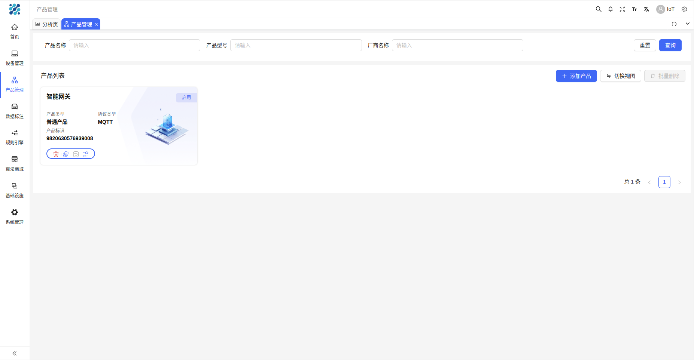
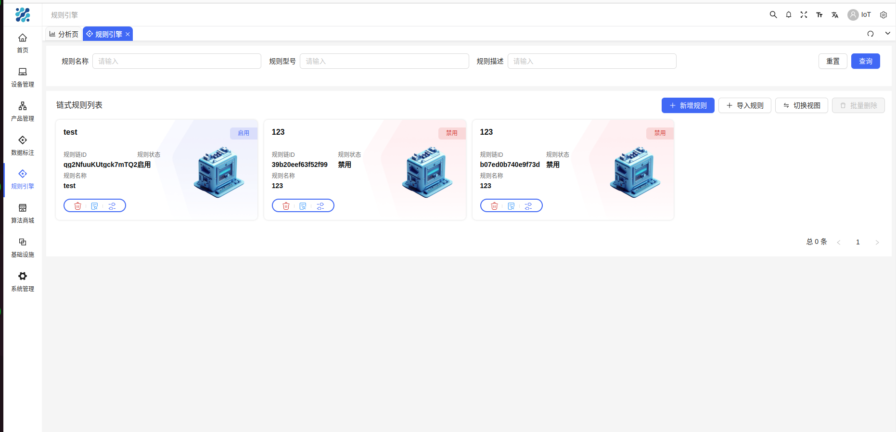
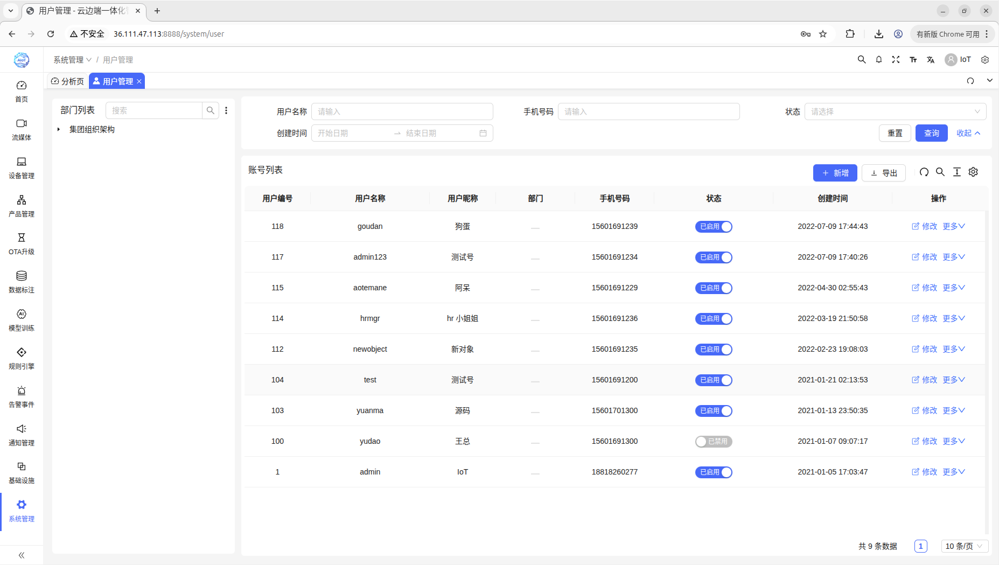
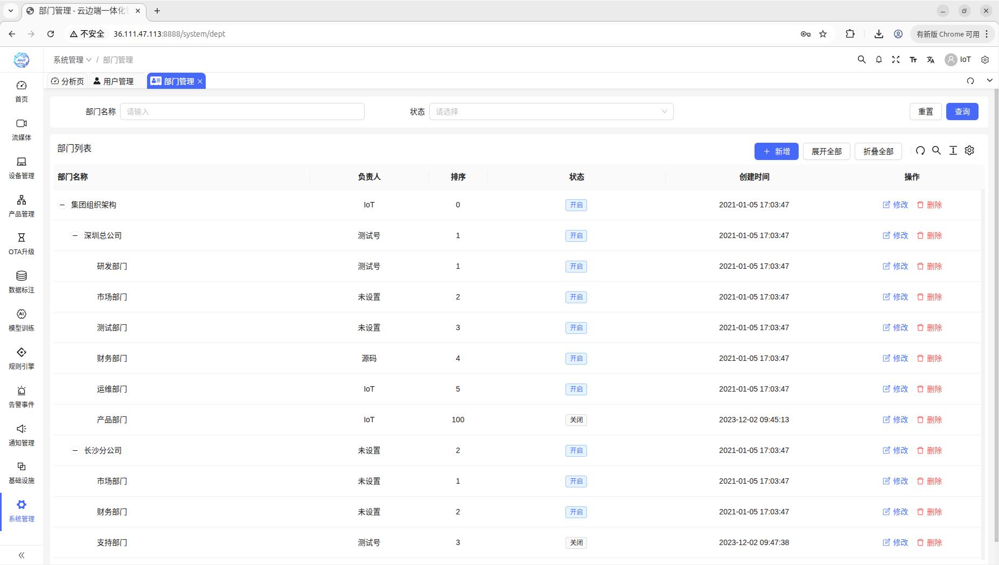
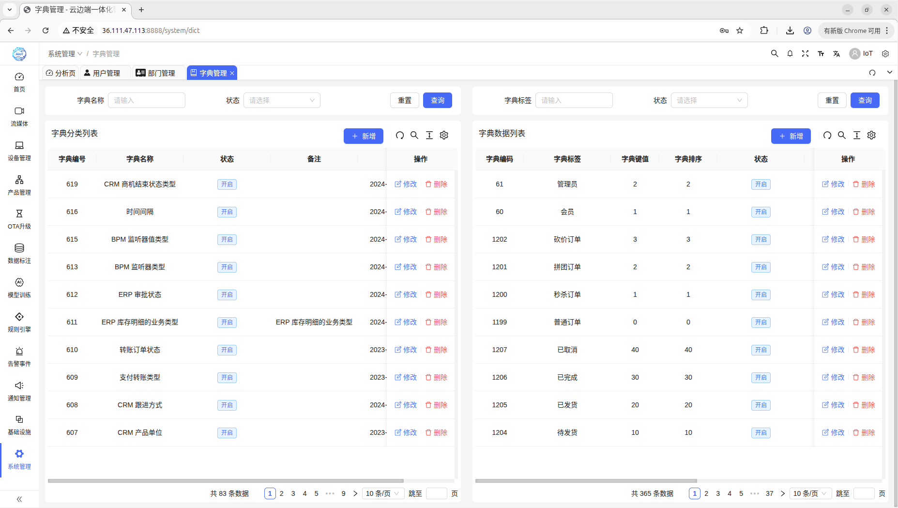
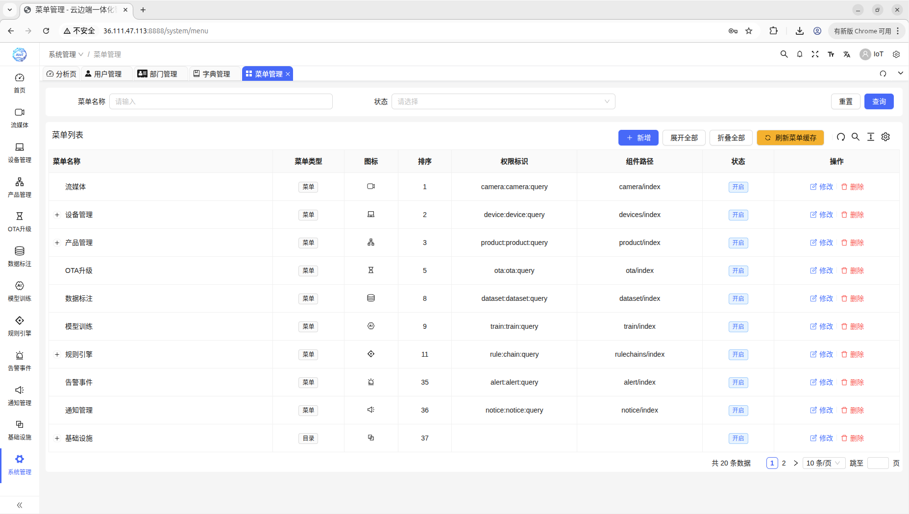

# EasyAIoT（深度智核AI云平台）
### 我希望全世界都能使用这个系统，实现AI的真正0门槛，人人都能体验到AI带来的好处，而并不只是掌握在少数人手里。

    

## 🌟 关于项目的一些思考
#### 我认为没有任何一个编程语言是擅长所有事情，但如果是3种编程语言混合，EasyAIoT将所向披靡，恰好我具备这种特质。
#### Java适合做平台但不适合网络编程和AI编程，Python适合做网络和AI编程但不适合做高性能任务执行，C++适合做高性能任务执行但不适合做前面两者做的事情，EasyAIoT设想是采用三合一语言混编，构建一个实现不太Easy，但是使用非常Easy的AIoT平台。

#### EasyAIoT其实不是一个项目，而是五个项目。
#### 好处是什么呢？假如说你在一个受限的设备上（比如RK3588），你只需要拿出其中某个项目就可以独立部署，所以看似这个项目是云平台，其实他也可以是边缘平台。

### 🌟 真开源不易，如果这个项目对您有帮助，请您点亮一颗Star再离开，这将是对我最大的支持！（在这个假开源横行的时代，这个项目就是一个异类，纯靠爱来发电）

## 🎯 适用场景

## 🛠️ 解决方案

  
  

## 🧩 项目结构
EasyAIoT由五个核心项目组成：
- **WEB模块**: 基于Vue的前端管理界面
- **DEVICE模块**: 基于Java的设备管理模块，负责IoT设备接入与管理
- **VIDEO模块**: 基于Python的视频处理模块，负责视频流处理与传输
- **AI模块**: 基于Python的人工智能处理模块，负责视频分析和AI算法执行
- **TASK模块**: 基于C++的高性能任务处理模块，负责计算密集型任务执行

## ☁️ EasyAIoT = AI + IoT = 云边一体化解决方案
支持上千种垂直场景，支持AI模型定制化和AI算法定制化开发，深度融合。

赋能万物智视：EasyAIoT 构筑了物联网设备（尤其是海量摄像头）的高效接入与管控网络。我们深度融合流媒体实时传输技术与前沿人工智能（AI），打造一体化服务核心。这套方案不仅打通了异构设备的互联互通，更将高清视频流与强大的AI解析引擎深度集成，赋予监控系统"智能之眼"——精准实现人脸识别、异常行为分析、风险人员布控及周界入侵检测

## ⚠️ 免责声明

EasyAIoT是一个开源学习项目，与商业行为无关。用户在使用该项目时，应遵循法律法规，不得进行非法活动。如果EasyAIoT发现用户有违法行为，将会配合相关机关进行调查并向政府部门举报。用户因非法行为造成的任何法律责任均由用户自行承担，如因用户使用造成第三方损害的，用户应当依法予以赔偿。使用EasyAIoT所有相关资源均由用户自行承担风险.

## 📚 官方文档
- 文档地址：http://pro.basiclab.top:9988/

## 🎮 演示环境
- 演示地址：http://pro.basiclab.top:8888/
- 账号：admin
- 密码：admin123

## 🔓 开源版
- **定位**：轻量、易用，聚焦技术驱动
- **适用场景**：适合个人学习与中小型项目使用
- **维护承诺**：开源版本功能足以满足大部分公司的业务诉求，不存在阉割的说法。开源版本依旧持续维护，请大家放心使用。

## 🏢 PRO版（定价仅为一名普通程序员一个月的工资）
在开源版本基础上扩展，面向企业场景，提供更完善的功能与性能优化

**适用场景**：满足中大型项目的业务与稳定性需求。

**主要扩展功能包括**：
- **NVR模块**：支持边缘录像设备，如：公安执法记录仪，车载记录仪，无人机等；
- **模型广场**：提供更多预训练模型选择；
- **垂直领域解决方案**：针对特定行业提供定制化解决方案；
- **SIP协议**：支持标准SIP协议通信；
- **模型集群部署**：支持大规模模型集群化部署；
- **算子在线定制化开发**：支持在线自定义算子开发；
- **GPU资源切割管理**：精细化管理GPU资源分配；
- **摄像头云台控制**：远程控制摄像头角度和位置；
- **云录像**：云端录像存储与管理；
- **批量抽帧分析**：支持视频批量抽帧进行智能分析。

**是否提供技术支持？**：提供一年技术支持，购买授权后可以提问项目相关问题，一对一解答。(基础技术问题答疑，而非帮忙定制开发，请知悉)

**是否可以开发票？**：可开票

## ⚙️ 项目地址
- Gitee: https://gitee.com/soaring-xiongkulu/easyaiot
- Github: https://github.com/soaring-xiongkulu/easyaiot

## 🛠️ 技术栈
### 前端
- **核心框架**：Vue 3.3.8
- **开发语言**：TypeScript 5.2.2
- **构建工具**：Vite 4.5.0
- **UI组件库**：Ant Design Vue 4.0.7
- **状态管理**：Pinia 2.1.7
- **路由**：Vue Router 4.2.5
- **HTTP客户端**：Axios/Alova 1.6.1
- **CSS**：UnoCSS 0.57.3
- **包管理器**：pnpm 9.0.4

### 后端
- **DEVICE模块框架**: 
  - Spring Boot 2.7.18
  - Spring Boot Starter Security
  - Gateway
  - SkyWalking
  - OpenFeign
  - Sentinel
  - Nacos
  - Kafka
  - TDEngine
  - MyBatis-Plus
  - PostgreSQL
- **AI模块框架**：
  - Python 3.11+
  - Flask
  - Flask-Cors
  - Flask-Migrate
  - Flask-SQLAlchemy
  - OpenCV (cv2)
  - Pillow (PIL.Image)
  - Ultralytics
  - Psycopg2-Binary
- **VIDEO模块框架**：
  - Python 3.11+
  - WSDiscovery
  - Netifaces
  - Onvif-Zeep
  - Pyserial
  - Paho_Mqtt
  - Flask
  - Flask-Cors
  - Flask-Migrate
  - Flask-SQLAlchemy
  - Psycopg2-Binary
- **TASK模块框架**：
  - C++17
  - Opencv2
  - Httplib
  - Json
  - Librknn
  - Minio-Cpp
  - Mk-Media
  - RGA
  - Logging
  - Queue
  - Thread

## 📸 截图

  
  

  
  

  
  

  
  

  
  

  
  

  
  

  
  

## 📞 联系方式
### 微信号（技术交流请加入知识星球）：

### 知识星球：
- 自愿有偿加入知识星球咨询、获取资料以及加入微信技术群。
- 如果你是学生，赞助任意金额，也可拉入微信技术群和知识星球【我非明珠，却愿为沃土，滋养新苗成栋梁】。

## 💰 打赏赞助

    
    

## 🙏 致谢
感谢以下各位对本项目包括但不限于代码贡献、问题反馈、资金捐赠等各种方式的支持！以下排名不分先后：
- shup 派大星 棒槌 憨憨 一往无前 文艺小青年 lion 汪汪队立大功 春生 二群主 hao_chen yuer629 kong 岁月静好 Kunkka 李江峰 左耳向右 Chao. 灶 
- Mr.LuCkY 泓 i 放学丶别走 Kosho 小菜鸟先飞 追溯未来-_- 贵阳王老板 kevin 青衫 贾仁超 Lee ㏒灵韵№  Fae wcj 碎碎念. 怒放de生命
- 蓝速传媒 Dorky TAT 北街 Achieve_Xu  NicholasLD 墨白 童年 take your time or 城市稻草人 小小白
 
## 📄 开源协议
[MIT LICENSE](LICENSE)

## ©️ 版权使用说明
EasyAIoT开源平台遵循 [MIT LICENSE](LICENSE) 协议。 允许商业使用，但务必保留类作者、Copyright 信息。