# EasyAIoT (Объединенная платформа интеллектуальных алгоритмов "Облако-Край-Устройство")

Я надеюсь, что эта система будет использоваться по всему миру, чтобы сделать ИИ действительно доступным для всех, чтобы каждый мог испытать преимущества ИИ, а не только узкая группа людей.

    

<h4 align="center" style="display: flex; justify-content: center; gap: 20px; flex-wrap: wrap; padding: 20px; font-weight: bold;">
  <a href="./README.md">English</a>
  |
  <a href="./README_zh.md">简体中文</a>
  |
  <a href="./README_zh_tw.md">繁體中文</a>
  |
  <a href="./README_ru.md">Русский</a>
  |
  <a href="./README_fr.md">Français</a>
  |
  <a href="./README_ko.md">한국어</a>
</h4>

## 🌟 Размышления о проекте

### 📍 Позиционирование проекта

EasyAIoT — это интеллектуальная платформа Интернета вещей с архитектурой "Облако-Край-Устройство", ориентированная на глубокую интеграцию ИИ и IoT. Через ключевые возможности, такие как управление алгоритмическими задачами, анализ потоков данных в реальном времени, кластерный вывод моделей и другие, платформа реализует полный замкнутый цикл от подключения устройств до сбора данных, анализа ИИ и интеллектуального принятия решений, по-настоящему воплощая идею "интернета всего" и "интеллектуального управления всем".

#### 🧠 Возможности ИИ

<ul style="font-size: 14px; line-height: 1.8; color: #444; margin: 10px 0;">
  <li><strong>Интеллектуальное понимание больших визуальных моделей</strong>: Интегрирована большая визуальная модель QwenVL3, поддерживает глубокое визуальное рассуждение и семантическое понимание видео в реальном времени, способна выполнять интеллектуальный анализ и понимание сцен содержимого кадров, предоставляет более богатые визуальные когнитивные возможности, достигая перехода от восприятия на уровне пикселей к пониманию на семантическом уровне</li>
  <li><strong>AI-анализ видео с камер в реальном времени</strong>: Поддерживает интеллектуальный AI-анализ видео с камер в реальном времени. Обрабатывает видеопотоки алгоритмами ИИ для обнаружения объектов, анализа поведения, распознавания аномалий и т.д. Предоставляет результаты анализа в реальном времени с откликом на уровне миллисекунд, поддерживает параллельный анализ нескольких видеопотоков.</li>
  <li><strong>Объединенная панель мониторинга предупреждений алгоритмов "Облако-Край-Устройство"</strong>: Предоставляет унифицированную панель мониторинга предупреждений алгоритмов "Облако-Край-Устройство" для отображения в реальном времени ключевой информации: состояния устройств, работы алгоритмических задач, статистики событий тревоги, результатов анализа видеопотоков и т.д. Поддерживает визуализацию данных в нескольких измерениях, реализует унифицированный мониторинг и управление облачными, пограничными и устройствами, предоставляя центрам управления интеллектуального мониторинга глобальный обзор.</li>
  <li><strong>Рисование областей обнаружения устройств</strong>: Предоставляет визуальный инструмент для рисования областей обнаружения устройств, поддерживает рисование прямоугольных и многоугольных областей обнаружения на снимках устройств, поддерживает гибкую конфигурацию связи между областями и алгоритмическими моделями, поддерживает визуальное управление, редактирование и удаление областей, поддерживает горячие клавиши для повышения эффективности рисования, обеспечивает точную конфигурацию обнаружения областей и предоставляет точные определения диапазона обнаружения для алгоритмических задач.</li>
  <li><strong>Интеллектуальный механизм связанных тревог</strong>: Поддерживает тройной механизм связи между областями обнаружения, периодами обороны и событиями тревоги. Система интеллектуально определяет, соответствует ли обнаруженное событие одновременно указанному диапазону области обнаружения, находится ли в периоде обороны и соответствует ли типу события тревоги. Тревоги активируются только при одновременном выполнении всех трех условий, обеспечивая точную пространственно-временную фильтрацию условий, значительно снижая частоту ложных срабатываний и повышая точность и практичность системы тревог.</li>
  <li><strong>Управление крупномасштабными камерами</strong>: Поддерживает подключение сотен камер, предоставляет полный спектр услуг: сбор, аннотирование, обучение, вывод, экспорт, анализ, оповещение, запись, хранение, развертывание.</li>
  <li><strong>Управление алгоритмическими задачами</strong>: Поддерживает создание и управление двумя типами алгоритмических задач. Каждая задача может гибко связываться с экстрактором кадров и сортировщиком для точного извлечения видеокадров и сортировки результатов.
    <ul style="margin: 5px 0; padding-left: 20px;">
      <li><strong>Задачи алгоритмов реального времени</strong>: Для анализа видео в реальном времени. Поддерживают обработку потоков RTSP/RTMP в реальном времени, обеспечивают возможности отклика на уровне миллисекунд. Подходят для сценариев реального времени, таких как наблюдение, безопасность.</li>
      <li><strong>Задачи алгоритмов захвата изображений</strong>: Для анализа захваченных изображений. Выполняют интеллектуальное распознавание и анализ захваченных изображений. Подходят для сценариев, таких как ретроспектива событий, поиск изображений.</li>
    </ul>
  </li>
  <li><strong>Переадресация потоков</strong>: Поддерживает прямой просмотр видео с камер в реальном времени без включения функций AI-анализа. Путем создания задач переадресации потоков можно выполнять пакетную переадресацию нескольких камер, обеспечивая синхронный просмотр нескольких видеопотоков для удовлетворения потребностей сценариев чистого видеомониторинга.</li>
  <li><strong>Кластерный вывод моделей</strong>: Поддерживает распределенный кластер служб вывода моделей, реализует интеллектуальную балансировку нагрузки, автоматическое переключение при сбоях и обеспечение высокой доступности, значительно повышая пропускную способность вывода и стабильность системы.</li>
  <li><strong>Управление периодами охраны</strong>: Поддерживает две стратегии охраны: полный режим и полурежим. Позволяет гибко настраивать правила охраны для разных периодов времени, реализуя точный интеллектуальный мониторинг и оповещение по расписанию.</li>
  <li><strong>OCR и распознавание речи</strong>: На основе PaddleOCR реализует распознавание текста высокой точности, поддерживает преобразование речи в текст, предоставляет возможности распознавания нескольких языков.</li>
  <li><strong>Мультимодальные большие визуальные модели</strong>: Поддерживают различные визуальные задачи, такие как распознавание объектов, распознавание текста, предоставляют мощные возможности понимания изображений и анализа сцен.</li>
  <li><strong>Большие языковые модели (LLM)</strong>: Поддерживают интеллектуальный анализ и понимание различных форматов ввода: потоки RTSP, видео, изображения, аудио, текст, реализуя мультимодальное понимание контента.</li>
  <li><strong>Развертывание моделей и управление версиями</strong>: Поддерживает быстрое развертывание моделей ИИ и управление версиями, реализуя однокнопочный запуск моделей, откат версий и постепенный релиз.</li>
  <li><strong>Управление несколькими экземплярами</strong>: Поддерживает параллельный запуск и планирование ресурсов нескольких экземпляров моделей, повышая утилизацию системы и эффективность использования ресурсов.</li>
  <li><strong>Захват изображений с камер</strong>: Поддерживает функцию мгновенного захвата изображений с камер. Позволяет настраивать правила захвата и условия срабатывания, реализуя интеллектуальный захват и запись событий.</li>
  <li><strong>Управление пространством для захваченных изображений</strong>: Предоставляет управление пространством хранения для захваченных изображений, поддерживает квоты на пространство и стратегии очистки, обеспечивая рациональное использование ресурсов хранения.</li>
  <li><strong>Управление пространством для видеозаписей</strong>: Предоставляет управление пространством хранения для файлов видеозаписей, поддерживает автоматическую очистку и архивирование, реализуя интеллектуальное управление ресурсами хранения.</li>
  <li><strong>Управление захваченными изображениями</strong>: Поддерживает полный жизненный цикл управления захваченными изображениями: просмотр, поиск, загрузку, удаление и т.д. Предоставляет удобные функции управления изображениями.</li>
  <li><strong>Управление каталогом устройств</strong>: Предоставляет древовидное управление каталогом устройств, поддерживает группировку устройств, иерархическое управление и контроль доступа, реализуя упорядоченную организацию и детализированное управление устройствами.</li>
  <li><strong>Запись по тревоге</strong>: Поддерживает функцию автоматической записи видео при срабатывании события тревоги. При обнаружении аномального события автоматически записывается соответствующий видеофрагмент, предоставляя полную цепочку доказательств для тревоги. Поддерживает просмотр, загрузку и управление записями по тревоге.</li>
  <li><strong>События тревоги</strong>: Предоставляет полный набор функций управления событиями тревоги. Поддерживает отправку уведомлений о событиях тревоги в реальном времени, исторические запросы, статистический анализ, обработку событий и отслеживание статуса, реализуя полный жизненный цикл управления тревогами.</li>
  <li><strong>Воспроизведение записей</strong>: Поддерживает быстрый поиск и воспроизведение исторических записей. Предоставляет удобные операции: навигация по временной шкале, изменение скорости воспроизведения, переход по ключевым кадрам. Поддерживает синхронное воспроизведение нескольких видеопотоков, удовлетворяя потребности в ретроспективе и анализе событий.</li>
</ul>

#### 🌐 Возможности IoT

<ul style="font-size: 14px; line-height: 1.8; color: #444; margin: 10px 0;">
  <li><strong>Подключение и управление устройствами</strong>: Регистрация устройств, аутентификация, мониторинг состояния, управление жизненным циклом.</li>
  <li><strong>Управление продуктами и моделями вещей</strong>: Определение продукта, настройка модели вещи, управление продуктами.</li>
  <li><strong>Поддержка множества протоколов</strong>: MQTT, TCP, HTTP и другие протоколы Интернета вещей.</li>
  <li><strong>Аутентификация устройств и динамическая регистрация</strong>: Безопасное подключение, проверка подлинности, динамическая регистрация устройств.</li>
  <li><strong>Движок правил</strong>: Правила маршрутизации данных, маршрутизация сообщений, преобразование данных.</li>
  <li><strong>Сбор и хранение данных</strong>: Сбор данных с устройств, хранение, запрос и анализ.</li>
  <li><strong>Мониторинг состояния устройств и управление предупреждениями</strong>: Мониторинг в реальном времени, предупреждения об аномалиях, интеллектуальное принятие решений.</li>
  <li><strong>Управление уведомлениями</strong>: Поддерживает 7 способов уведомлений, включая Feishu, DingTalk, Enterprise WeChat, Email, Tencent Cloud SMS, Alibaba Cloud SMS и Webhook, обеспечивая гибкие многоканальные уведомления о предупреждениях.</li>
</ul>

### 💡 Техническая философия

Мы считаем, что ни один язык программирования не может быть хорош во всем, но благодаря глубокой интеграции трех языков программирования, EasyAIoT использует преимущества каждого, создавая мощную технологическую экосистему.

Java хорошо подходит для создания стабильной и надежной архитектуры платформы, но не подходит для сетевого программирования и программирования ИИ. Python хорош для сетевого программирования и разработки алгоритмов ИИ, но имеет узкие места в выполнении высокопроизводительных задач. C++ отлично справляется с высокопроизводительными задачами, но уступает первым двум в разработке платформ и программировании ИИ. EasyAIoT использует архитектуру смешанного программирования трех языков, в полной мере используя преимущества каждого, чтобы построить AIoT-платформу, создание которой представляет собой сложную задачу, но использование которой чрезвычайно удобно.

### 🔄 Поток данных между модулями

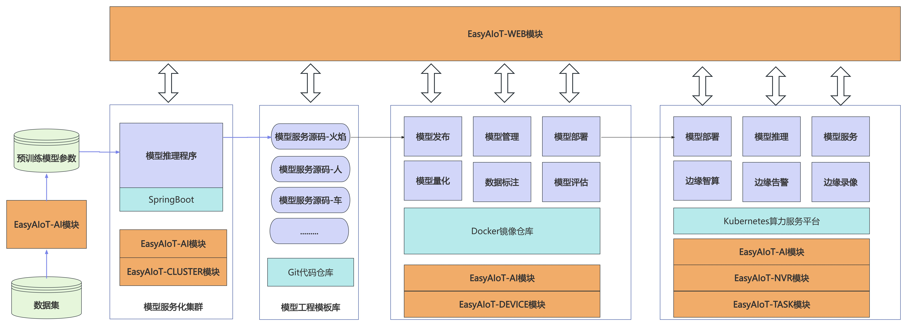

### 🤖 Технология аннотирования с нулевым образцом

Инновационно построена система аннотирования с нулевым образцом на основе больших моделей (в идеальном состоянии полностью устраняя ручной процесс аннотирования, реализуя автоматизацию процесса разметки). Эта технология использует большие модели для генерации исходных данных и завершает автоматическое аннотирование с помощью техник промптов, затем обеспечивает качество данных через проверку человеком (опционально), после чего обучает начальную малую модель. Эта малая модель через непрерывные итерации и самооптимизацию достигает совместной эволюции эффективности аннотирования и точности модели, в конечном итоге продвигая производительность системы вверх.

### 🏗️ Особенности архитектуры проекта

EasyAIoT на самом деле не один проект, а пять проектов.

В чем преимущество? Если вы находитесь на ограниченном устройстве (например, RK3588), вы можете просто взять один из этих проектов и развернуть его независимо. Поэтому, хотя этот проект выглядит как облачная платформа, на самом деле он также может быть пограничной платформой.

🌟 Настоящий open-source — это непросто. Если этот проект помог вам, пожалуйста, поставьте звезду (Star), прежде чем уйти, это будет для меня самой большой поддержкой! 
<small style="font-size: 14px; opacity: 0.9;">(В эпоху, когда псевдо-open-source повсюду, этот проект — исключение, работающий на чистом энтузиазме)</small>

### 🌍 Поддержка локализации

EasyAIoT активно поддерживает стратегию локализации, всесторонне поддерживает локальное оборудование и операционные системы, предоставляя пользователям безопасные и контролируемые решения AIoT:

<h4 style="margin-top: 0; color: white; font-size: 18px;">🖥️ Поддержка на стороне сервера</h4>
<ul style="font-size: 14px; line-height: 1.8; margin: 10px 0; padding-left: 20px;">
  <li>Полная совместимость с процессорами архитектуры x86 от Hygon</li>
  <li>Поддержка локальных серверных аппаратных платформ</li>
  <li>Предоставление целевых решений по оптимизации производительности</li>
  <li>Обеспечение стабильной работы корпоративных приложений</li>
</ul>

<h4 style="margin-top: 0; color: white; font-size: 18px;">📱 Поддержка на пограничной стороне</h4>
<ul style="font-size: 14px; line-height: 1.8; margin: 10px 0; padding-left: 20px;">
  <li>Полная поддержка чипов архитектуры ARM от Rockchip</li>
  <li>Идеальная адаптация к основным пограничным вычислительным платформам, таким как RK3588</li>
  <li>Глубокая оптимизация для пограничных сценариев</li>
  <li>Реализация облегченного развертывания интеллектуальных возможностей на периферии</li>
</ul>

<h4 style="margin-top: 0; color: white; font-size: 18px;">🖱️ Поддержка операционных систем</h4>
<ul style="font-size: 14px; line-height: 1.8; margin: 10px 0; padding-left: 20px;">
  <li>Совместимость с операционной системой Kylin</li>
  <li>Поддержка локализованных дистрибутивов Linux, таких как Founder</li>
  <li>Адаптация к основным локализованным ОС, таким как Tongxin UOS</li>
  <li>Предоставление полных локализованных решений по развертыванию</li>
</ul>

## 🎯 Применимые сценарии

## 🧩 Структура проекта

EasyAIoT состоит из пяти основных проектов:

<table style="width: 100%; border-collapse: collapse; margin: 20px 0; font-size: 14px;">
<tr>
<td style="padding: 15px; border: 1px solid #e0e0e0; background-color: #f8f9fa; font-weight: 600; color: #2c3e50; width: 20%;">Модуль</td>
<td style="padding: 15px; border: 1px solid #e0e0e0; background-color: #f8f9fa; font-weight: 600; color: #2c3e50;">Описание</td>
</tr>
<tr>
<td style="padding: 15px; border: 1px solid #e0e0e0; vertical-align: top;"><strong>WEB модуль</strong></td>
<td style="padding: 15px; border: 1px solid #e0e0e0; line-height: 1.8; color: #444;">Интерфейс управления на основе Vue, обеспечивающий единообразный пользовательский опыт.</td>
</tr>
<tr>
<td style="padding: 15px; border: 1px solid #e0e0e0; vertical-align: top;"><strong>DEVICE модуль</strong></td>
<td style="padding: 15px; border: 1px solid #e0e0e0; line-height: 1.8; color: #444;">
  <ul style="margin: 5px 0; padding-left: 20px;">
    <li><strong>Техническое преимущество</strong>: Основан на JDK21, предоставляет лучшую производительность и современные функции.</li>
    <li><strong>Управление устройствами</strong>: Регистрация устройств, аутентификация, мониторинг состояния, управление жизненным циклом.</li>
    <li><strong>Управление продуктами</strong>: Определение продукта, управление моделями вещей, конфигурация продукта.</li>
    <li><strong>Поддержка протоколов</strong>: MQTT, TCP, HTTP и другие протоколы IoT.</li>
    <li><strong>Аутентификация устройств</strong>: Динамическая регистрация устройств, проверка подлинности, безопасное подключение.</li>
    <li><strong>Движок правил</strong>: Правила маршрутизации данных, маршрутизация сообщений, преобразование данных.</li>
    <li><strong>Сбор данных</strong>: Сбор данных с устройств, хранение, запрос и анализ.</li>
  </ul>
</td>
</tr>
<tr>
<td style="padding: 15px; border: 1px solid #e0e0e0; vertical-align: top;"><strong>VIDEO модуль</strong></td>
<td style="padding: 15px; border: 1px solid #e0e0e0; line-height: 1.8; color: #444;">
  <ul style="margin: 5px 0; padding-left: 20px;">
    <li><strong>Обработка потокового мультимедиа</strong>: Поддерживает обработку и передачу потоков RTSP/RTMP в реальном времени.</li>
    <li><strong>Управление алгоритмическими задачами</strong>: Поддерживает два типа задач: алгоритмы реального времени и алгоритмы захвата изображений, для анализа видео в реальном времени и анализа захваченных изображений соответственно.</li>
    <li><strong>Экстракторы кадров и сортировщики</strong>: Поддерживает гибкие стратегии извлечения кадров и механизмы сортировки результатов. Каждая алгоритмическая задача может быть связана с независимым экстрактором кадров и сортировщиком.</li>
    <li><strong>Периоды охраны</strong>: Поддерживает конфигурацию по расписанию для полного и полурежимов охраны.</li>
  </ul>
</td>
</tr>
<tr>
<td style="padding: 15px; border: 1px solid #e0e0e0; vertical-align: top;"><strong>AI модуль</strong></td>
<td style="padding: 15px; border: 1px solid #e0e0e0; line-height: 1.8; color: #444;">
  <ul style="margin: 5px 0; padding-left: 20px;">
    <li><strong>Интеллектуальный анализ</strong>: Отвечает за анализ видео и выполнение алгоритмов ИИ.</li>
    <li><strong>Кластер служб моделей</strong>: Поддерживает распределенный вывод моделей, реализует балансировку нагрузки и высокую доступность.</li>
    <li><strong>Вывод в реальном времени</strong>: Предоставляет возможности интеллектуального анализа в реальном времени с откликом на уровне миллисекунд.</li>
    <li><strong>Управление моделями</strong>: Поддерживает развертывание моделей, управление версиями и планирование нескольких экземпляров.</li>
  </ul>
</td>
</tr>
<tr>
<td style="padding: 15px; border: 1px solid #e0e0e0; vertical-align: top;"><strong>TASK модуль</strong></td>
<td style="padding: 15px; border: 1px solid #e0e0e0; line-height: 1.8; color: #444;">Модуль обработки высокопроизводительных задач на основе C++, отвечающий за выполнение ресурсоемких вычислительных задач.</td>
</tr>
</table>

## 🖥️ Преимущества кроссплатформенного развертывания

EasyAIoT поддерживает развертывание в трех основных операционных системах: Linux, Mac, Windows, предоставляя гибкие и удобные решения развертывания для пользователей в различных средах:

<h4 style="margin-top: 0; color: white; font-size: 18px;">🐧 Преимущества развертывания на Linux</h4>
<ul style="font-size: 14px; line-height: 1.8; margin: 10px 0; padding-left: 20px;">
  <li>Подходит для производственных сред, стабилен, надежен, низкое потребление ресурсов.</li>
  <li>Поддерживает развертывание в контейнерах Docker, запуск всех служб одной кнопкой.</li>
  <li>Идеально адаптирован для серверов, пограничных вычислительных устройств (таких как RK3588 и другие устройства с архитектурой ARM).</li>
  <li>Предоставляет полные скрипты автоматической установки, упрощающие процесс развертывания.</li>
</ul>

<h4 style="margin-top: 0; color: white; font-size: 18px;">🍎 Преимущества развертывания на Mac</h4>
<ul style="font-size: 14px; line-height: 1.8; margin: 10px 0; padding-left: 20px;">
  <li>Подходит для сред разработки и тестирования, глубоко интегрирован с macOS.</li>
  <li>Поддерживает локальную разработку и отладку, быстрое подтверждение функциональности.</li>
  <li>Предоставляет удобные скрипты установки, поддерживает менеджеры пакетов, такие как Homebrew.</li>
</ul>

<h4 style="margin-top: 0; color: white; font-size: 18px;">🪟 Преимущества развертывания на Windows</h4>
<ul style="font-size: 14px; line-height: 1.8; margin: 10px 0; padding-left: 20px;">
  <li>Подходит для сред Windows Server, снижает затраты на обучение.</li>
  <li>Поддерживает автоматизированные скрипты PowerShell, упрощает операции развертывания.</li>
  <li>Совместим с Windows Server и настольными версиями Windows.</li>
  <li>Предоставляет графические мастера установки, удобные для пользователя.</li>
</ul>

<strong>Единообразный опыт</strong>: Независимо от выбора операционной системы, EasyAIoT предоставляет согласованные скрипты установки и документацию по развертыванию, обеспечивая единообразие опыта кроссплатформенного развертывания.

## ☁️ EasyAIoT = AI + IoT = Объединенное решение "Облако-Край-Устройство"

Поддерживает тысячи вертикальных сценариев, поддерживает кастомизацию моделей ИИ и разработку алгоритмов ИИ, глубокая интеграция.

<h3 style="color: #2c3e50; margin-top: 0;">Расширение возможностей интеллектуального зрения всего: EasyAIoT</h3>

Создает эффективную сеть подключения и управления устройствами Интернета вещей (особенно огромным количеством камер). Мы глубоко интегрируем технологии передачи потокового мультимедиа в реальном времени с передовым искусственным интеллектом (ИИ), создавая ядро единого сервиса. Это решение не только обеспечивает взаимодействие разнородных устройств, но и глубоко интегрирует видеопотоки высокой четкости с мощным движком анализа ИИ, наделяя системы видеонаблюдения "интеллектуальным зрением" — точно реализуя распознавание лиц, анализ аномального поведения, контроль над рискованными лицами и обнаружение вторжений на периметре.

Платформа поддерживает два типа алгоритмических задач: задачи алгоритмов реального времени для анализа видео в реальном времени из потоков RTSP/RTMP, обеспечивая отклик на уровне миллисекунд; задачи алгоритмов захвата изображений для интеллектуального анализа захваченных изображений, поддерживая ретроспективу событий и поиск изображений. Через управление алгоритмическими задачами реализуются гибкие стратегии извлечения кадров и сортировки, каждая задача может быть связана с независимым экстрактором кадров и сортировщиком. В сочетании с возможностями кластерного вывода моделей это обеспечивает отклик на уровне миллисекунд и высокую доступность. Одновременно предоставляются две стратегии охраны: полный режим и полурежим, которые можно гибко настраивать в соответствии с разными периодами времени для точного интеллектуального мониторинга и оповещения по расписанию.

В управлении устройствами Интернета вещей EasyAIoT предоставляет полные возможности управления жизненным циклом устройств, поддерживает множество протоколов IoT (MQTT, TCP, HTTP), реализуя быстрое подключение устройств, безопасную аутентификацию, мониторинг в реальном времени и интеллектуальное управление. Через движок правил реализуется интеллектуальная маршрутизация и обработка данных устройств. В сочетании с возможностями ИИ выполняется углубленный анализ данных устройств, реализуя полную автоматизацию процесса от подключения устройств, сбора данных, интеллектуального анализа до выполнения решений, по-настоящему воплощая идею "интернета всего" и "интеллектуального управления всем".

## ⚠️ Отказ от ответственности

EasyAIoT — это проект с открытым исходным кодом для обучения, не связанный с коммерческой деятельностью. При использовании данного проекта пользователи должны соблюдать законы и правила, не допуская незаконных действий. Если EasyAIoT обнаружит незаконные действия пользователя, он будет сотрудничать с соответствующими органами в расследовании и сообщать правительственным органам. Любая юридическая ответственность, возникающая в результате незаконных действий пользователей, лежит на самих пользователях. Если использование пользователем причиняет ущерб третьим сторонам, пользователь должен возместить ущерб в соответствии с законом. Все связанные ресурсы EasyAIoT используются пользователями на свой собственный риск.

## 📚 Документация по развертыванию

- [Документация по развертыванию платформы](.doc/部署文档/平台部署文档_ru.md)

## 🎮 Демонстрационная среда

- Демо-адрес: http://36.111.47.113:8888/
- Логин: admin
- Пароль: admin123

## ⚙️ Адреса проекта

- Gitee: https://gitee.com/soaring-xiongkulu/easyaiot
- Github: https://github.com/soaring-xiongkulu/easyaiot

## 📸 Скриншоты

  
  

  
  

  
  

  
  

  
  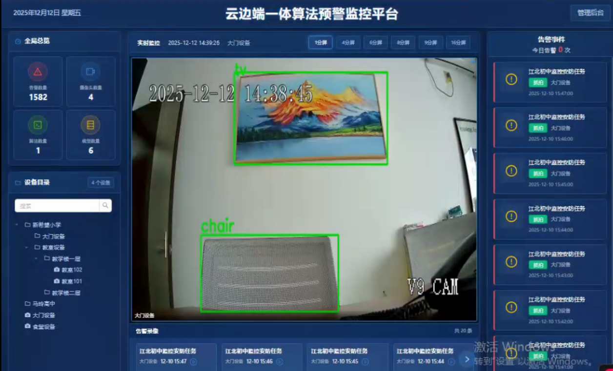

  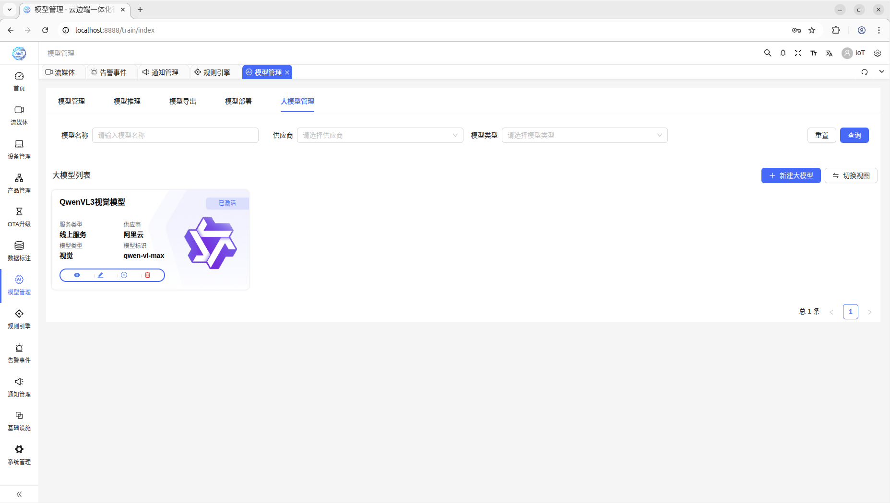
  

  
  

  
  

  
  

  
  

  
  

  
  

  
  

  
  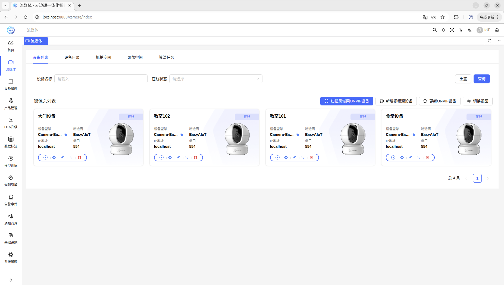

  
  

  
  

  
  

  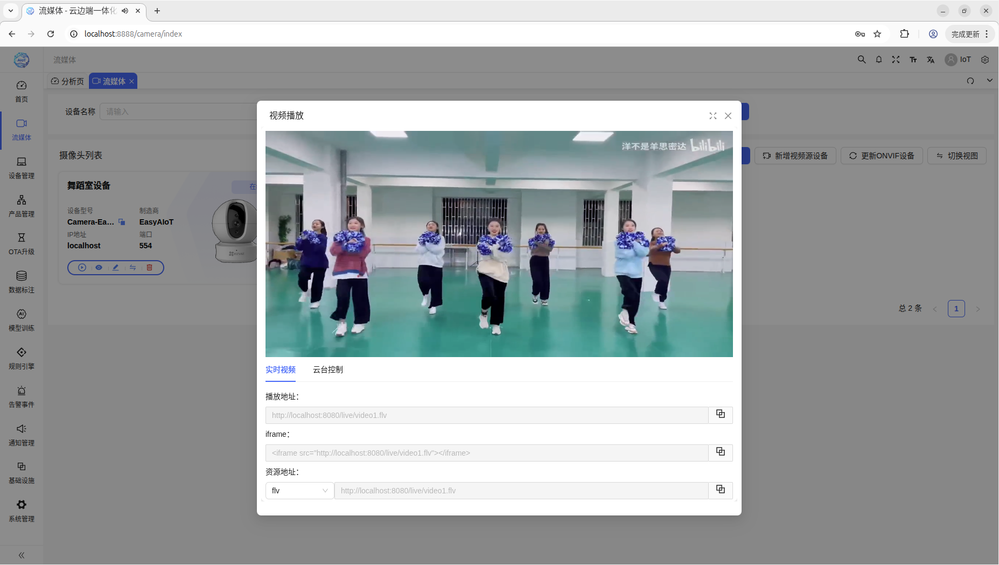
  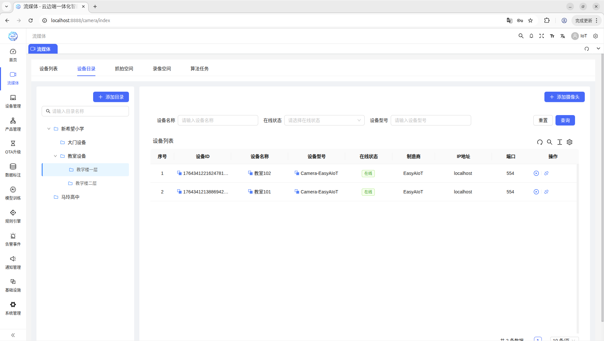

  
  

  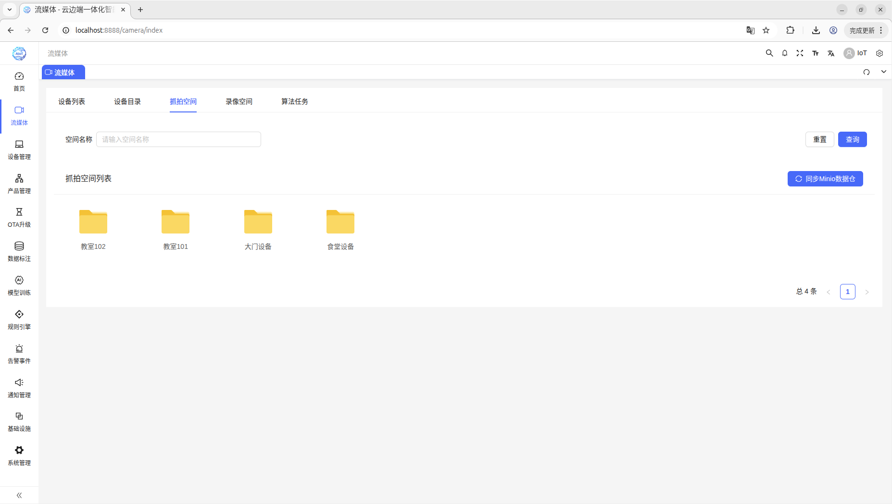
  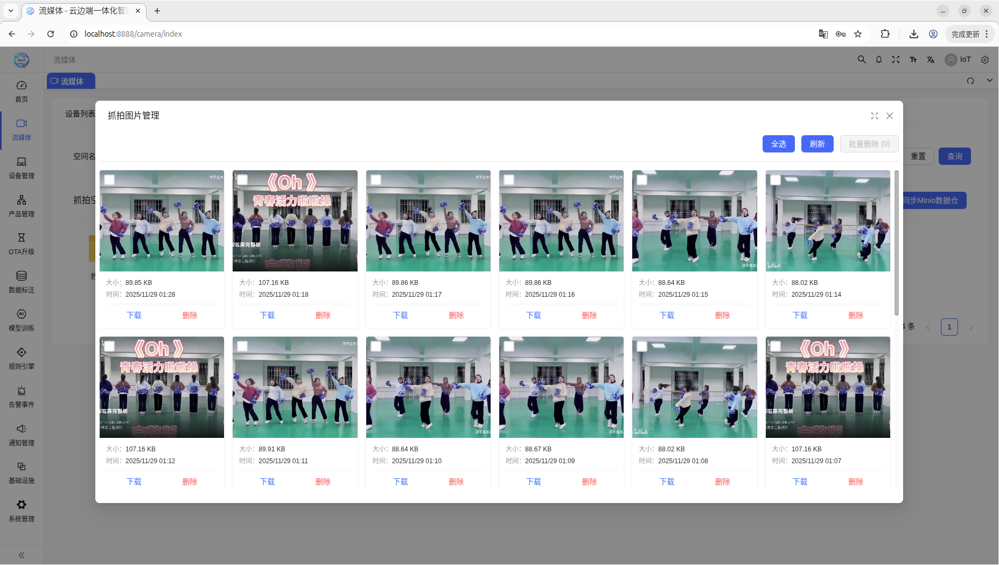

  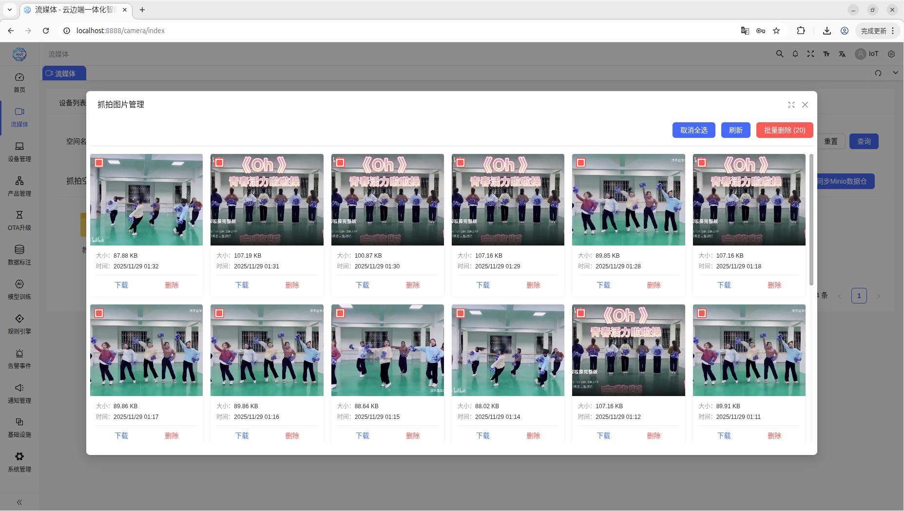
  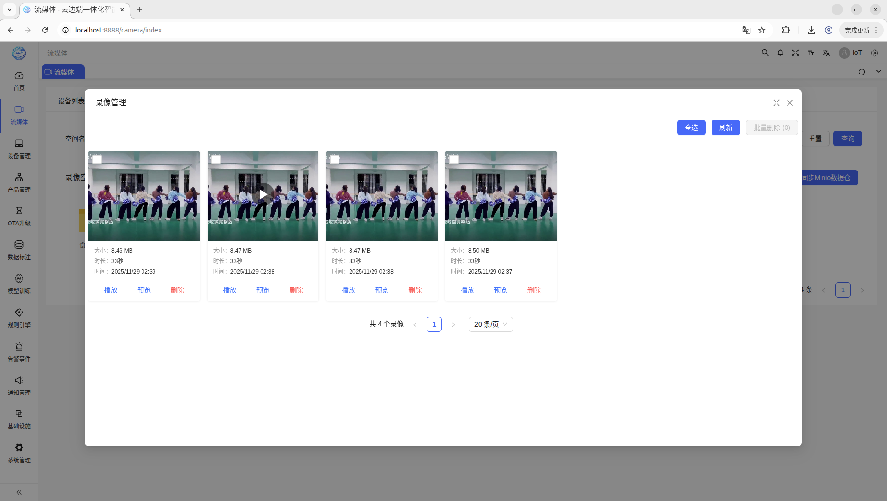

  
  

  
  

  
  

  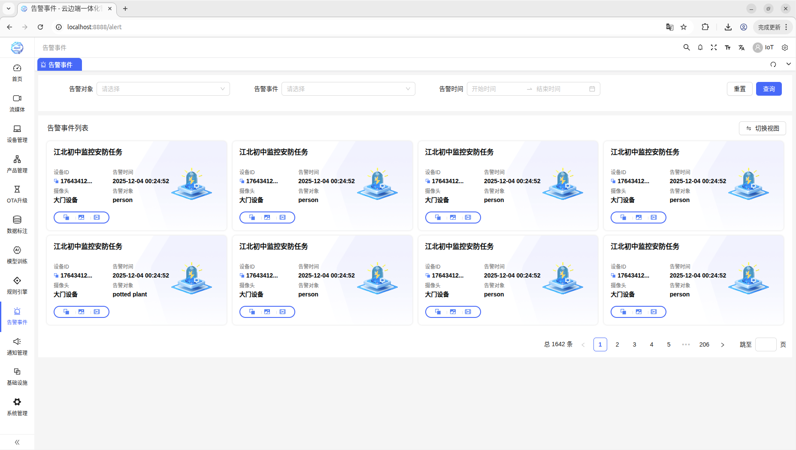
  

  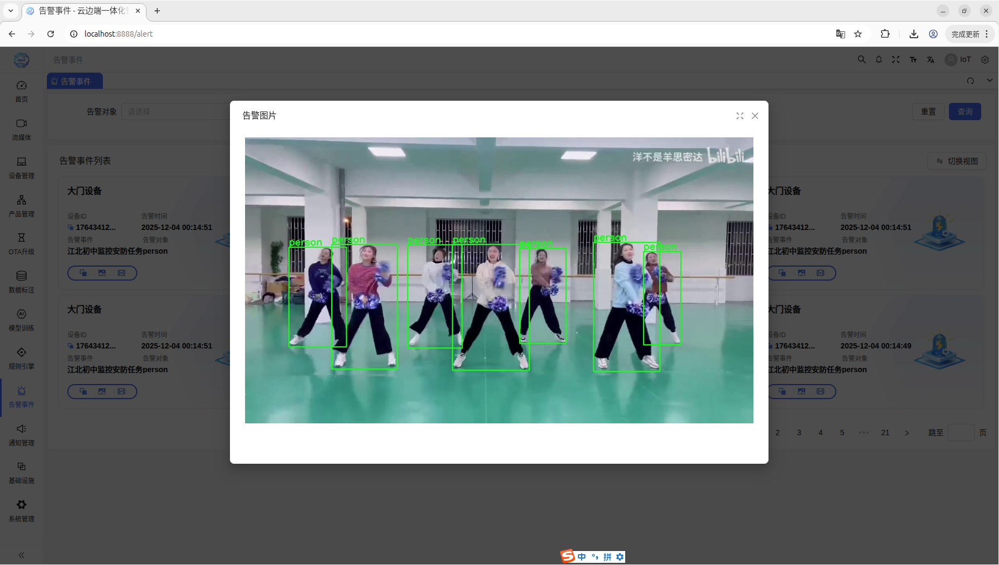
  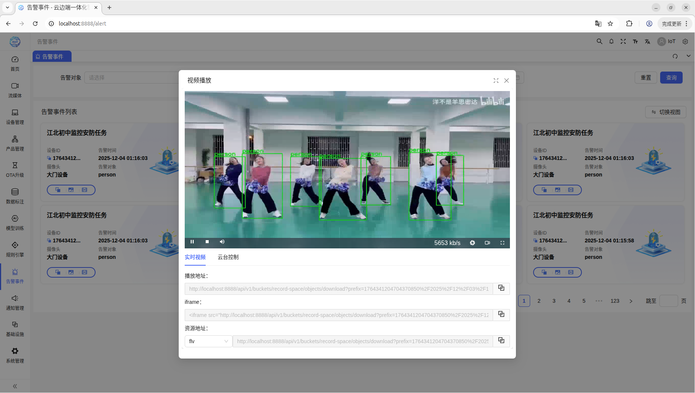

  
  

  
  

  
  

  
  

  
  

  
  

  
  

  
  

  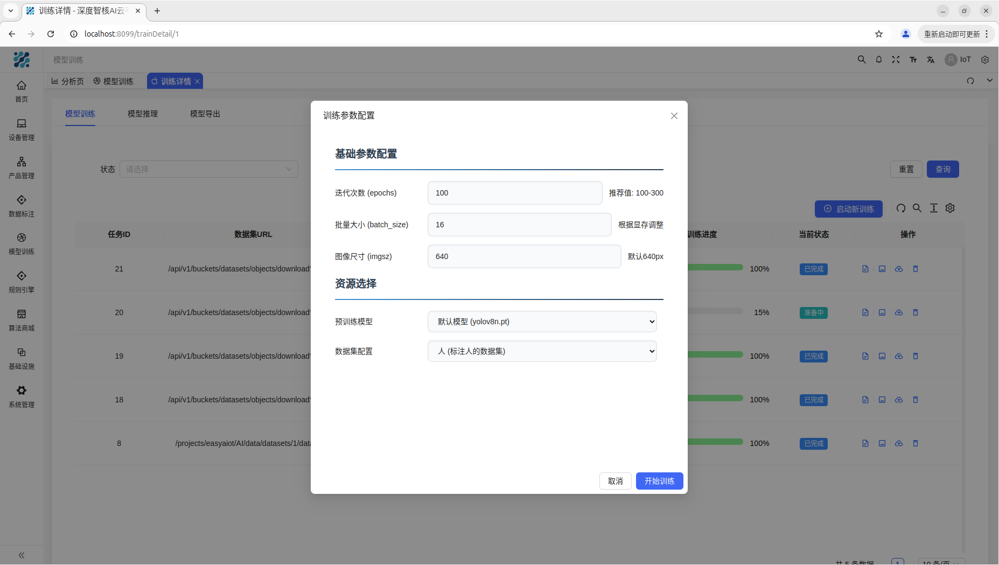
  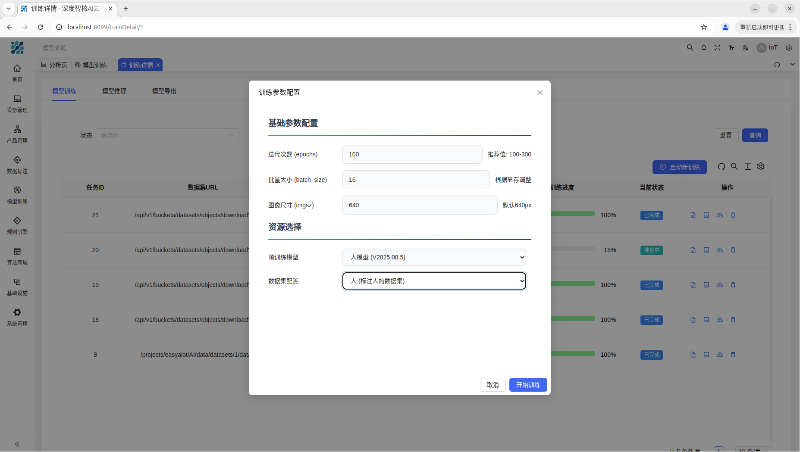

  
  

  
  

  
  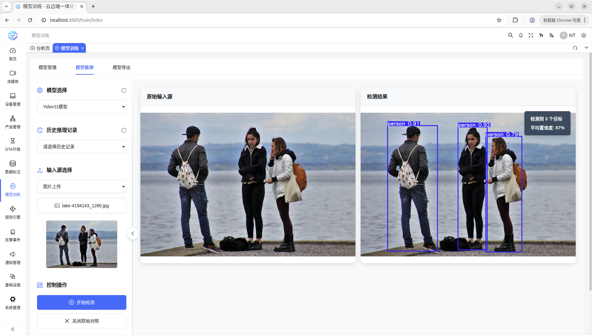

  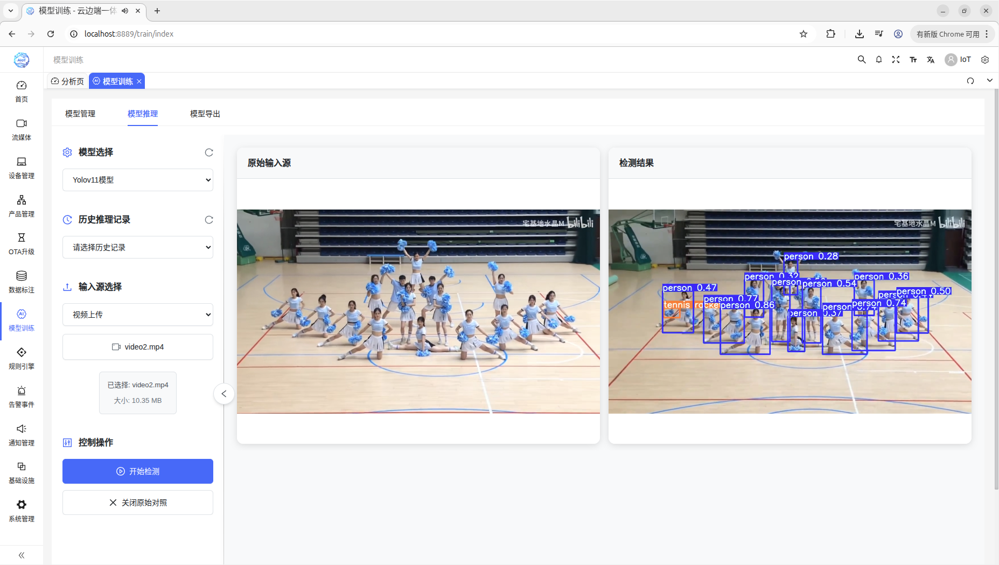
  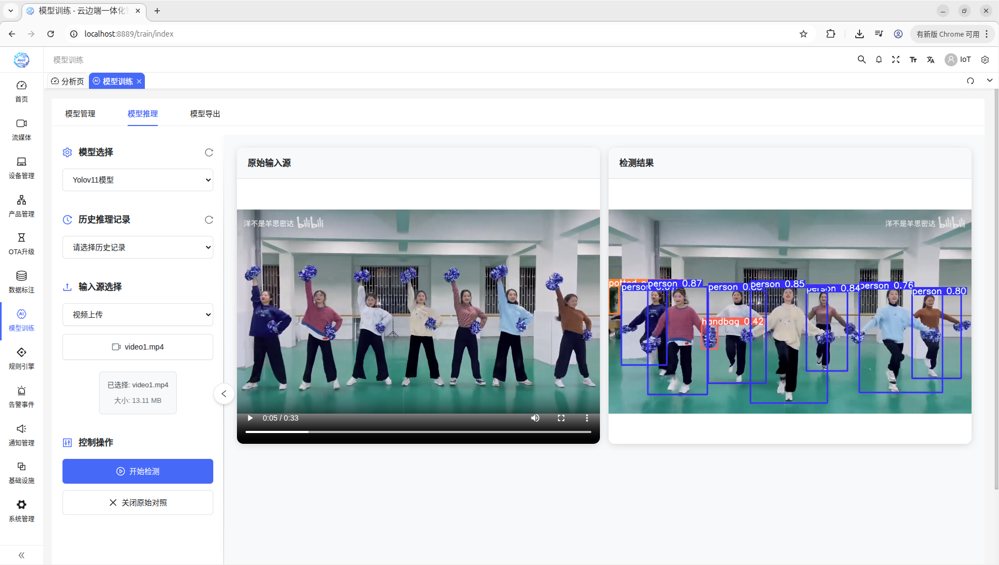

  
  

  
  

  
  

  
  

  
  

  
  

  
  

## 🛠️ Поддержка сервиса

Мы предоставляем различные способы сервиса, чтобы помочь вам глубже понять платформу и код EasyAIoT. Через документацию продукта, технические группы общения, платное обучение и другие способы вы получите следующие услуги:

<table style="width: 100%; border-collapse: collapse; margin: 20px 0; font-size: 14px; box-shadow: 0 2px 8px rgba(0,0,0,0.1);">
<thead>
<tr style="background: linear-gradient(135deg, #667eea 0%, #764ba2 100%); color: white;">
<th style="padding: 15px; text-align: left; font-weight: 600;">Сервисная позиция</th>
<th style="padding: 15px; text-align: left; font-weight: 600;">Содержание сервиса</th>
<th style="padding: 15px; text-align: center; font-weight: 600;">Стоимость сервиса</th>
<th style="padding: 15px; text-align: left; font-weight: 600;">Способ сервиса</th>
</tr>
</thead>
<tbody>
<tr style="background-color: #f8f9fa;">
<td style="padding: 15px; border: 1px solid #e0e0e0; font-weight: 600; color: #2c3e50;">Развертывание системы</td>
<td style="padding: 15px; border: 1px solid #e0e0e0; color: #444;">Завершение развертывания EasyAIoT в указанной пользователем сетевой и аппаратной среде.</td>
<td style="padding: 15px; border: 1px solid #e0e0e0; text-align: center; color: #e74c3c; font-weight: 600;">500 юаней</td>
<td style="padding: 15px; border: 1px solid #e0e0e0; color: #444;">Онлайн поддержка развертывания</td>
</tr>
<tr>
<td style="padding: 15px; border: 1px solid #e0e0e0; font-weight: 600; color: #2c3e50;">Техническая поддержка</td>
<td style="padding: 15px; border: 1px solid #e0e0e0; color: #444;">Ответы на вопросы, возникающие при развертывании, использовании функций и т.д.</td>
<td style="padding: 15px; border: 1px solid #e0e0e0; text-align: center; color: #e74c3c; font-weight: 600;">200 юаней</td>
<td style="padding: 15px; border: 1px solid #e0e0e0; color: #444;">Полчаса удаленной онлайн поддержки</td>
</tr>
<tr>
<td style="padding: 15px; border: 1px solid #e0e0e0; font-weight: 600; color: #2c3e50;">Другие услуги</td>
<td style="padding: 15px; border: 1px solid #e0e0e0; color: #444;">Кастомизированная разработка решений для вертикальных областей; кастомизированное время, функциональные услуги и т.д.</td>
<td style="padding: 15px; border: 1px solid #e0e0e0; text-align: center; color: #e74c3c; font-weight: 600;">Обсуждается</td>
<td style="padding: 15px; border: 1px solid #e0e0e0; color: #444;">Обсуждается</td>
</tr>
</tbody>
</table>

## 📞 Контакты (после добавления в WeChat необходимо подписаться на официальный аккаунт для вступления в техническую группу)

  
  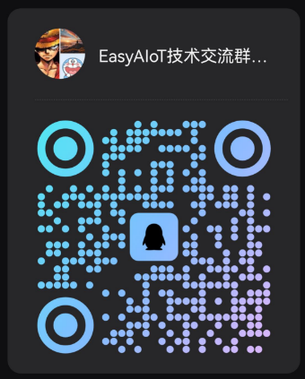

## 👥 Официальный аккаунт

  

## 🪐 Знаниевая планета:

  

## 💰 Спонсорство и пожертвования

    
    

## 🤝 Руководство по участию

Мы приветствуем все формы участия! Независимо от того, являетесь ли вы разработчиком кода, автором документации или сообщающим о проблемах, ваш вклад поможет сделать EasyAIoT лучше. Вот основные способы участия:

<h4 style="margin-top: 0; color: white; font-size: 18px;">💻 Вклад в код</h4>
<ul style="font-size: 14px; line-height: 1.8; margin: 10px 0; padding-left: 20px;">
  <li>Сделайте Fork проекта в свой аккаунт GitHub/Gitee</li>
  <li>Создайте ветку функции (git checkout -b feature/AmazingFeature)</li>
  <li>Зафиксируйте изменения (git commit -m 'Add some AmazingFeature')</li>
  <li>Отправьте в ветку (git push origin feature/AmazingFeature)</li>
  <li>Откройте Pull Request</li>
</ul>

<h4 style="margin-top: 0; color: white; font-size: 18px;">📚 Вклад в документацию</h4>
<ul style="font-size: 14px; line-height: 1.8; margin: 10px 0; padding-left: 20px;">
  <li>Улучшите существующее содержание документации</li>
  <li>Добавьте примеры использования и лучшие практики</li>
  <li>Предоставьте многоязычные переводы</li>
  <li>Исправьте ошибки в документации</li>
</ul>

<h4 style="margin-top: 0; color: white; font-size: 18px;">🌟 Другие способы участия</h4>
<ul style="font-size: 14px; line-height: 1.8; margin: 10px 0; padding-left: 20px;">
  <li>Сообщайте и исправляйте ошибки</li>
  <li>Предлагайте улучшения функций</li>
  <li>Участвуйте в обсуждениях сообщества и помогайте другим разработчикам</li>
  <li>Делитесь опытом использования и примерами</li>
</ul>

## 🌟 Ключевые участники

Ниже представлены выдающиеся участники, внесшие значительный вклад в проект EasyAIoT. Их вклад сыграл ключевую роль в развитии проекта. Мы выражаем нашу самую искреннюю благодарность!

<table style="width: 100%; border-collapse: collapse; margin: 20px 0; font-size: 14px; box-shadow: 0 2px 8px rgba(0,0,0,0.1);">
<thead>
<tr style="background: linear-gradient(135deg, #667eea 0%, #764ba2 100%); color: white;">
<th style="padding: 15px; text-align: left; font-weight: 600; border: 1px solid #e0e0e0;">Участник</th>
<th style="padding: 15px; text-align: left; font-weight: 600; border: 1px solid #e0e0e0;">Вклад</th>
</tr>
</thead>
<tbody>
<tr style="background-color: #f8f9fa;">
<td style="padding: 15px; border: 1px solid #e0e0e0; font-weight: 600; color: #2c3e50; width: 20%;">℡夏别</td>
<td style="padding: 15px; border: 1px solid #e0e0e0; color: #444; line-height: 1.8;">Внес вклад в документацию по развертыванию Windows для проекта EasyAIoT, предоставив полное руководство по развертыванию для пользователей платформы Windows, значительно снизив сложность развертывания в средах Windows и позволив большему количеству пользователей легко использовать платформу EasyAIoT.</td>
</tr>
<tr>
<td style="padding: 15px; border: 1px solid #e0e0e0; font-weight: 600; color: #2c3e50; width: 20%;">YiYaYiYaho</td>
<td style="padding: 15px; border: 1px solid #e0e0e0; color: #444; line-height: 1.8;">Внес вклад в скрипт однокликового развертывания контейнеров Mac для проекта EasyAIoT, предоставив автоматизированное решение для развертывания для пользователей платформы Mac, значительно упростив процесс развертывания в средах Mac и улучшив опыт развертывания для разработчиков и пользователей.</td>
</tr>
<tr style="background-color: #f8f9fa;">
<td style="padding: 15px; border: 1px solid #e0e0e0; font-weight: 600; color: #2c3e50; width: 20%;">山寒</td>
<td style="padding: 15px; border: 1px solid #e0e0e0; color: #444; line-height: 1.8;">Внес вклад в скрипт развертывания контейнеров Linux для проекта EasyAIoT, предоставив решение для контейнеризованного развертывания для пользователей платформы Linux, достигнув быстрого и надежного развертывания контейнеров и обеспечив важные гарантии для стабильной работы в производственных средах.</td>
</tr>
<tr>
<td style="padding: 15px; border: 1px solid #e0e0e0; font-weight: 600; color: #2c3e50; width: 20%;">玖零。</td>
<td style="padding: 15px; border: 1px solid #e0e0e0; color: #444; line-height: 1.8;">Внес вклад в скрипт развертывания контейнеров Linux для проекта EasyAIoT, дополнительно улучшив решение для контейнеризованного развертывания для платформ Linux, предоставив больше возможностей для пользователей различных дистрибутивов Linux и способствуя возможностям кроссплатформенного развертывания проекта.</td>
</tr>
</tbody>
</table>

<strong>Особая благодарность</strong>: Работа вышеупомянутых участников заложила прочную основу для возможностей кроссплатформенного развертывания EasyAIoT. Их профессионализм и самоотверженная преданность достойны нашего изучения и уважения. Еще раз выражаем нашу самую искреннюю благодарность этим выдающимся участникам! 🙏

## 🙏 Благодарности

Благодарим следующих людей за поддержку данного проекта, включая, помимо прочего, вклад в код, обратную связь по проблемам, финансовые пожертвования и другие способы! Следующий список в произвольном порядке:
<table>
  <tbody>
    <tr>
      <td align="center" valign="top" width="11.11%"><a href="https://gitee.com/bcake" target="_blank">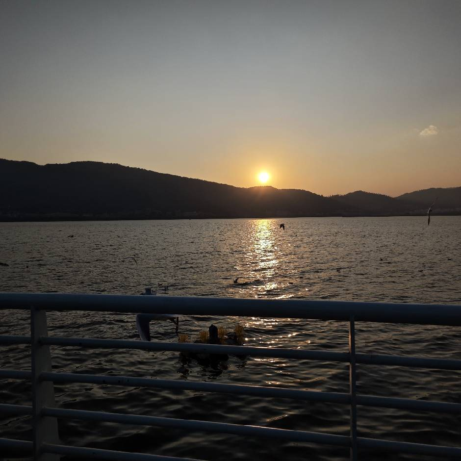 <b>大饼</b></a></td>
      <td align="center" valign="top" width="11.11%"><a href="https://gitee.com/jiang4yu" target="_blank"> <b>山寒</b></a></td>
      <td align="center" valign="top" width="11.11%"><a href="https://gitee.com/baobaomo" target="_blank"> <b>放学丶别走</b></a></td>
      <td align="center" valign="top" width="11.11%"><a href="https://gitee.com/wagger" target="_blank"> <b>春和</b></a></td>
      <td align="center" valign="top" width="11.11%"><a href="https://gitee.com/longbinwu" target="_blank"> <b>章鱼小丸子</b></a></td>
      <td align="center" valign="top" width="11.11%"><a href="javascript:void(0)" target="_blank"> <b>Catwings</b></a></td>
      <td align="center" valign="top" width="11.11%"><a href="javascript:void(0)" target="_blank"> <b>小工头</b></a></td>
      <td align="center" valign="top" width="11.11%"><a href="javascript:void(0)" target="_blank"> <b>西乡一粒沙</b></a></td>
      <td align="center" valign="top" width="11.11%"><a href="https://gitee.com/L_Z_M" target="_blank"> <b>玖零。</b></a></td>
    </tr>
    <tr>
      <td align="center" valign="top" width="11.11%"><a href="https://gitee.com/36436022" target="_blank"> <b>金鸿伟</b></a></td>
      <td align="center" valign="top" width="11.11%"><a href="https://gitee.com/cnlijf" target="_blank"> <b>李江峰</b></a></td>
      <td align="center" valign="top" width="11.11%"><a href="javascript:void(0)" target="_blank"> <b>Best Yao</b></a></td>
      <td align="center" valign="top" width="11.11%"><a href="https://gitee.com/weiloser" target="_blank"> <b>无为而治</b></a></td>
      <td align="center" valign="top" width="11.11%"><a href="https://gitee.com/shup092_admin" target="_blank"> <b>shup</b></a></td>
      <td align="center" valign="top" width="11.11%"><a href="https://gitee.com/gampa" target="_blank"> <b>也许</b></a></td>
      <td align="center" valign="top" width="11.11%"><a href="https://gitee.com/leishaozhuanshudi" target="_blank"> <b>⁰ʚᦔrꫀꪖꪑ⁰ɞ .</b></a></td>
      <td align="center" valign="top" width="11.11%"><a href="https://gitee.com/fateson" target="_blank"> <b>逆</b></a></td>
      <td align="center" valign="top" width="11.11%"><a href="https://gitee.com/dongGezzz_admin" target="_blank">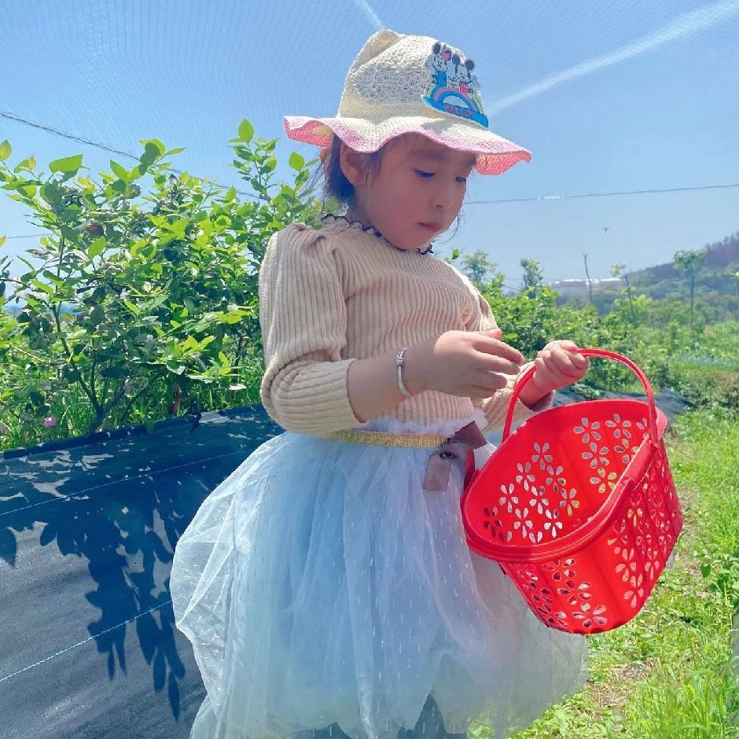 <b>廖东旺</b></a></td>
    </tr>
    <tr>
      <td align="center" valign="top" width="11.11%"><a href="https://gitee.com/huangzhen1993" target="_blank">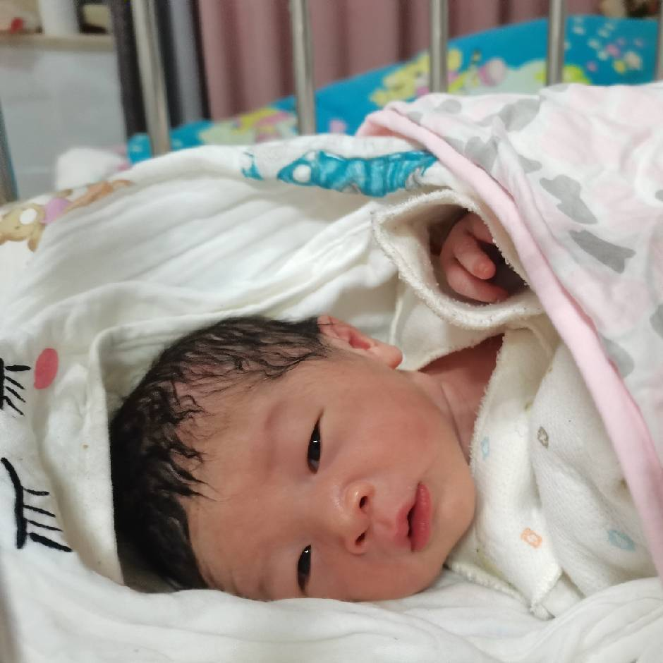 <b>黄振</b></a></td>
      <td align="center" valign="top" width="11.11%"><a href="https://github.com/fengchunshen" target="_blank"> <b>春生</b></a></td>
      <td align="center" valign="top" width="11.11%"><a href="https://gitee.com/mrfox_wang" target="_blank"> <b>贵阳王老板</b></a></td>
      <td align="center" valign="top" width="11.11%"><a href="https://gitee.com/haobaby" target="_blank"> <b>hao_chen</b></a></td>
      <td align="center" valign="top" width="11.11%"><a href="https://gitee.com/finalice" target="_blank"> <b>尽千</b></a></td>
      <td align="center" valign="top" width="11.11%"><a href="https://gitee.com/yuer629" target="_blank"> <b>yuer629</b></a></td>
      <td align="center" valign="top" width="11.11%"><a href="https://gitee.com/cai-peikai/ai-project" target="_blank">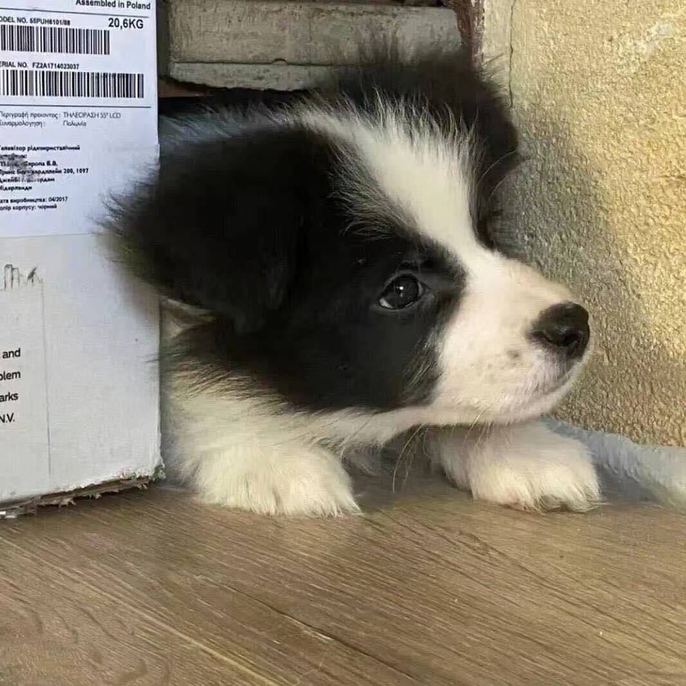 <b>kong</b></a></td>
      <td align="center" valign="top" width="11.11%"><a href="https://gitee.com/HB1731276584" target="_blank"> <b>岁月静好</b></a></td>
      <td align="center" valign="top" width="11.11%"><a href="https://gitee.com/hy5128" target="_blank"> <b>Kunkka</b></a></td>
    </tr>
    <tr>
      <td align="center" valign="top" width="11.11%"><a href="https://gitee.com/guo-dida" target="_blank"> <b>灬</b></a></td>
      <td align="center" valign="top" width="11.11%"><a href="https://github.com/XyhBill" target="_blank">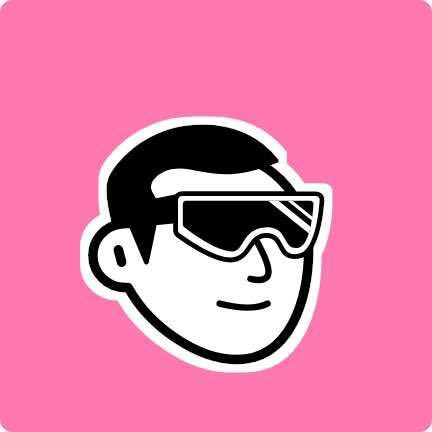 <b>Mr.LuCkY</b></a></td>
      <td align="center" valign="top" width="11.11%"><a href="https://gitee.com/timeforeverz" target="_blank"> <b>泓</b></a></td>
      <td align="center" valign="top" width="11.11%"><a href="https://gitee.com/mySia" target="_blank"> <b>i</b></a></td>
      <td align="center" valign="top" width="11.11%"><a href="javascript:void(0)" target="_blank"> <b>依依</b></a></td>
      <td align="center" valign="top" width="11.11%"><a href="https://gitee.com/sunbirder" target="_blank"> <b>小菜鸟先飞</b></a></td>
      <td align="center" valign="top" width="11.11%"><a href="https://gitee.com/mmy0" target="_blank"> <b>追溯未来</b></a></td>
      <td align="center" valign="top" width="11.11%"><a href="https://gitee.com/ccqingshan" target="_blank"> <b>青衫</b></a></td>
      <td align="center" valign="top" width="11.11%"><a href="https://gitee.com/jiangchunJava" target="_blank"> <b>Fae</b></a></td>
    </tr>
    <tr>
      <td align="center" valign="top" width="11.11%"><a href="https://gitee.com/huang-xiangtai" target="_blank">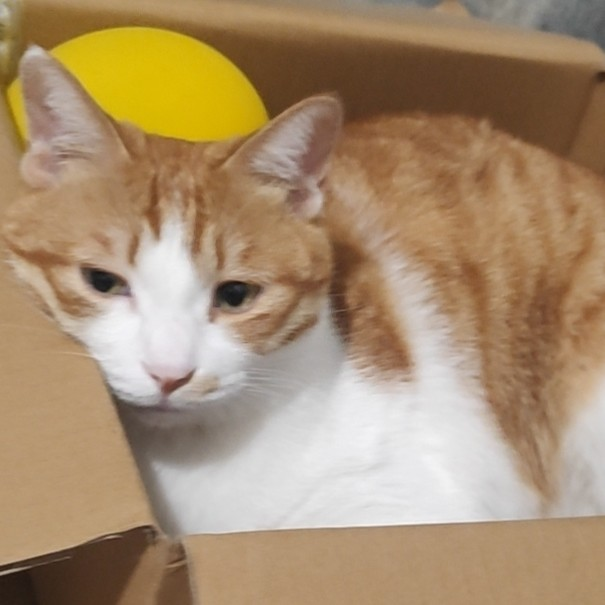 <b>憨憨</b></a></td>
      <td align="center" valign="top" width="11.11%"><a href="https://gitee.com/gu-beichen-starlight" target="_blank"> <b>文艺小青年</b></a></td>
      <td align="center" valign="top" width="11.11%"><a href="https://github.com/zhangnanchao" target="_blank"> <b>lion</b></a></td>
      <td align="center" valign="top" width="11.11%"><a href="https://gitee.com/yupccc" target="_blank"> <b>汪汪队立大功</b></a></td>
      <td align="center" valign="top" width="11.11%"><a href="https://gitee.com/wcjjjjjjj" target="_blank"> <b>wcj</b></a></td>
      <td align="center" valign="top" width="11.11%"><a href="https://gitee.com/hufanglei" target="_blank"> <b>怒放de生命</b></a></td>
      <td align="center" valign="top" width="11.11%"><a href="https://gitee.com/juyunsuan" target="_blank"> <b>蓝速传媒</b></a></td>
      <td align="center" valign="top" width="11.11%"><a href="https://gitee.com/achieve275" target="_blank"> <b>Achieve_Xu</b></a></td>
      <td align="center" valign="top" width="11.11%"><a href="https://gitee.com/nicholasld" target="_blank"> <b>NicholasLD</b></a></td>
    </tr>
    <tr>
      <td align="center" valign="top" width="11.11%"><a href="https://gitee.com/ADVISORYZ" target="_blank"> <b>ADVISORYZ</b></a></td>
      <td align="center" valign="top" width="11.11%"><a href="https://gitee.com/dongxinji" target="_blank"> <b>take your time or</b></a></td>
      <td align="center" valign="top" width="11.11%"><a href="https://github.com/xu756" target="_blank"> <b>碎碎念.</b></a></td>
      <td align="center" valign="top" width="11.11%"><a href="https://gitee.com/lwisme" target="_blank"> <b>北街</b></a></td>
      <td align="center" valign="top" width="11.11%"><a href="https://gitee.com/yu-xinyan71" target="_blank"> <b>Dorky TAT</b></a></td>
      <td align="center" valign="top" width="11.11%"><a href="https://gitee.com/chenxiaohong" target="_blank"> <b>右耳向西</b></a></td>
      <td align="center" valign="top" width="11.11%"><a href="https://github.com/派大星" target="_blank"> <b>派大星</b></a></td>
      <td align="center" valign="top" width="11.11%"><a href="https://gitee.com/wz_vue_gitee_181" target="_blank">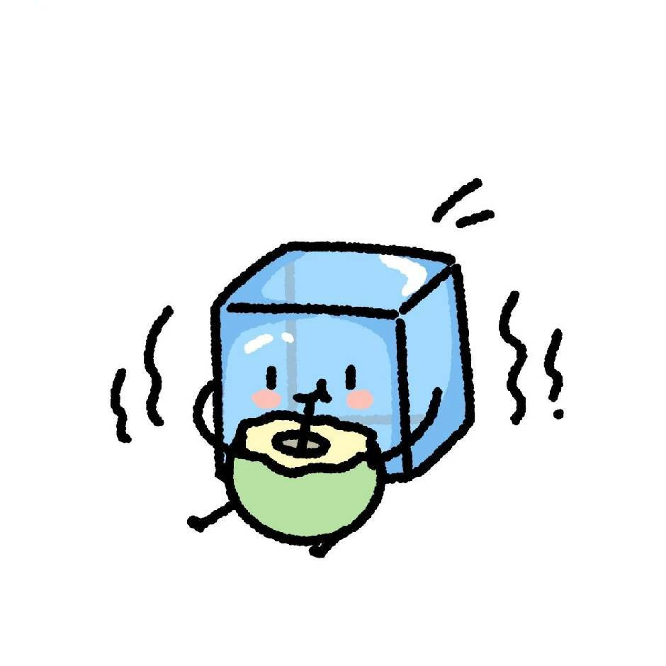 <b>棒槌</b></a></td>
      <td align="center" valign="top" width="11.11%"><a href="https://gitee.com/nctwo" target="_blank"> <b>信微输传助手</b></a></td>
    </tr>
    <tr>
      <td align="center" valign="top" width="11.11%"><a href="https://gitee.com/l9999_admin" target="_blank"> <benen>一往无前</benen></a></td>
      <td align="center" valign="top" width="11.11%"><a href="https://gitee.com/stenin" target="_blank"> <b>Charon</b></a></td>
      <td align="center" valign="top" width="11.11%"><a href="https://gitee.com/zhao-yihuiwifi" target="_blank"> <b>赵WIFI.</b></a></td>
      <td align="center" valign="top" width="11.11%"><a href="https://gitee.com/Yang619" target="_blank"> <b>Chao.</b></a></td>
      <td align="center" valign="top" width="11.11%"><a href="https://gitee.com/lcrsd123" target="_blank"> <b>城市稻草人</b></a></td>
      <td align="center" valign="top" width="11.11%"><a href="https://gitee.com/Mo_bai1016" target="_blank"> <b>Bug写手墨白</b></a></td>
      <td align="center" valign="top" width="11.11%"><a href="https://gitee.com/kevinosc_admin" target="_blank">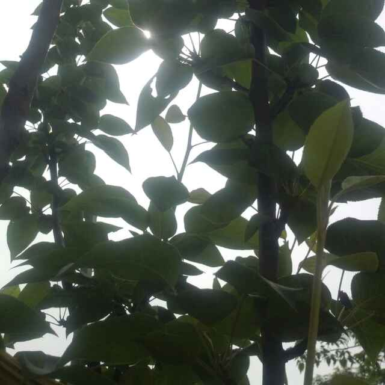 <b>kevin</b></a></td>
      <td align="center" valign="top" width="11.11%"><a href="https://gitee.com/lhyicn" target="_blank">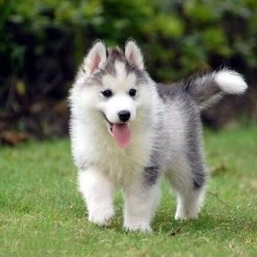 <b>童年</b></a></td>
      <td align="center" valign="top" width="11.11%"><a href="https://gitee.com/dubai100" target="_blank">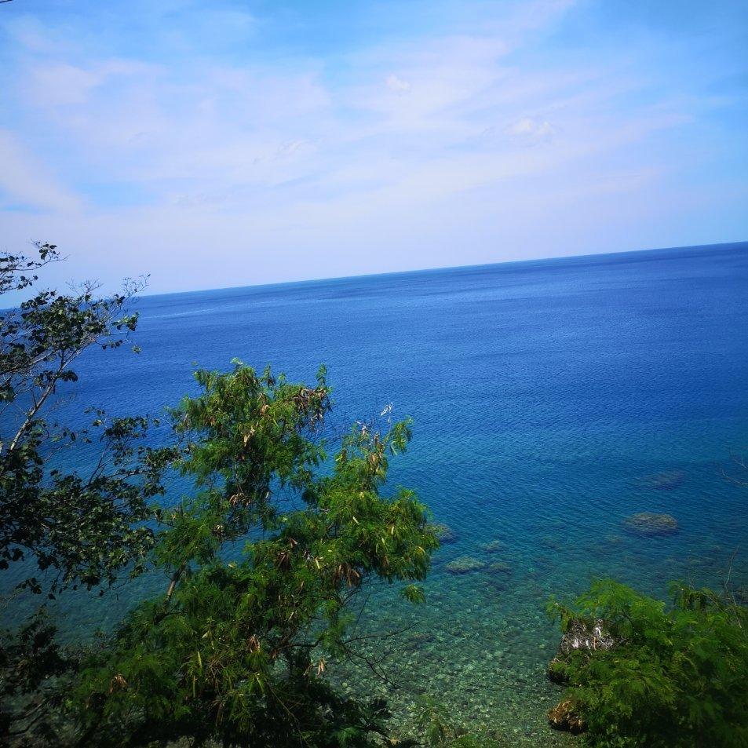 <b>sherry金</b></a></td>
    </tr>
    <tr>
        <td align="center" valign="top" width="11.11%"><a href="javascript:void(0)" target="_blank"> <b>℡夏别</b></a></td>
        <td align="center" valign="top" width="11.11%"><a href="javascript:void(0)" target="_blank"> <b>翠翠草原</b></a></td>
        <td align="center" valign="top" width="11.11%"><a href="javascript:void(0)" target="_blank"> <b>慕容曦</b></a></td>
        <td align="center" valign="top" width="11.11%"><a href="javascript:void(0)" target="_blank"> <b>Tyrion</b></a></td>
        <td align="center" valign="top" width="11.11%"><a href="javascript:void(0)" target="_blank"> <b>大漠孤烟</b></a></td>
        <td align="center" valign="top" width="11.11%"><a href="javascript:void(0)" target="_blank"> <b>Return</b></a></td>
        <td align="center" valign="top" width="11.11%"><a href="javascript:void(0)" target="_blank"> <b>一杯拿铁</b></a></td>
        <td align="center" valign="top" width="11.11%"><a href="javascript:void(0)" target="_blank"> <b>Thuri</b></a></td>
        <td align="center" valign="top" width="11.11%"><a href="javascript:void(0)" target="_blank">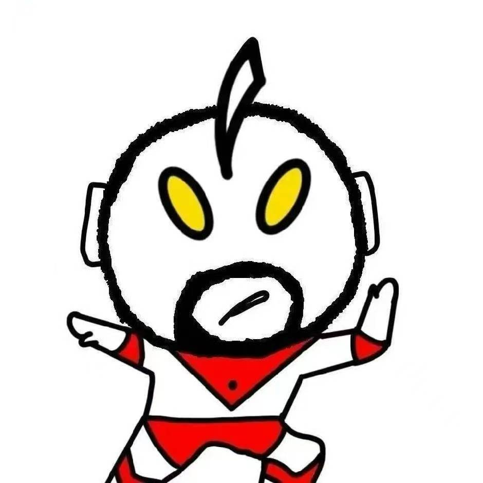 <b>Liu</b></a></td>
    </tr>
    <tr>
        <td align="center" valign="top" width="11.11%"><a href="javascript:void(0)" target="_blank">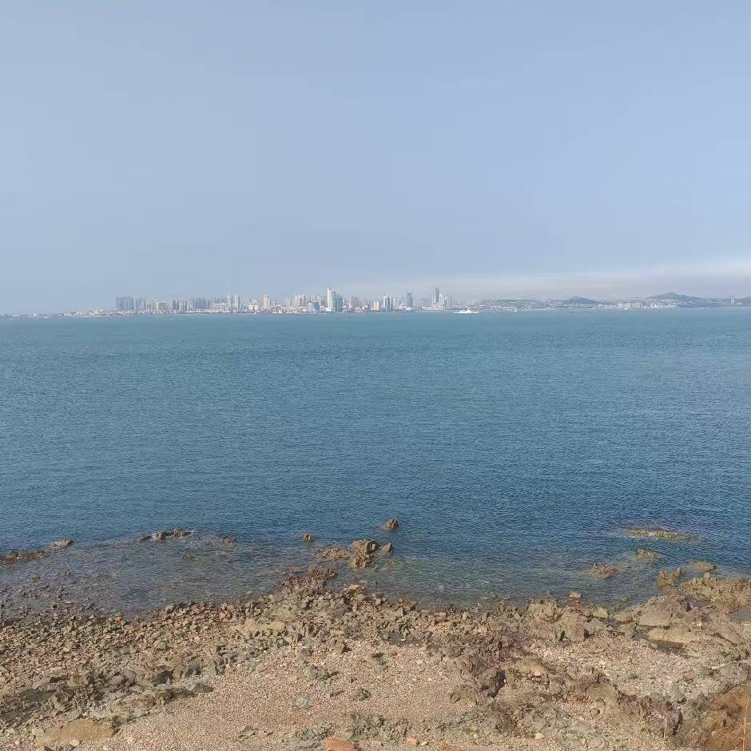 <b>三金</b></a></td>
        <td align="center" valign="top" width="11.11%"><a href="javascript:void(0)" target="_blank"> <b>ZPort</b></a></td>
        <td align="center" valign="top" width="11.11%"><a href="javascript:void(0)" target="_blank"> <b>Li</b></a></td>
        <td align="center" valign="top" width="11.11%"><a href="javascript:void(0)" target="_blank">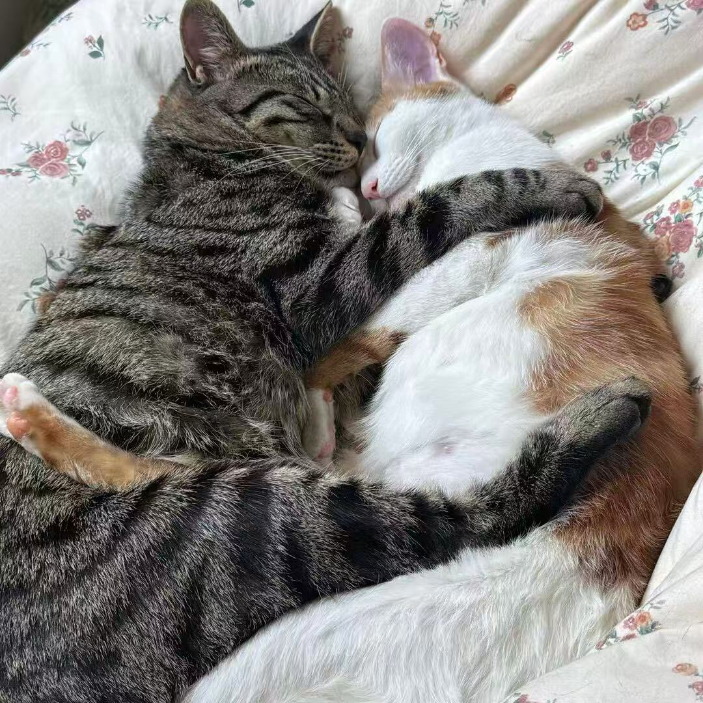 <b>嘉树</b></a></td>
        <td align="center" valign="top" width="11.11%"><a href="javascript:void(0)" target="_blank">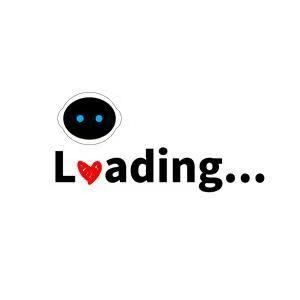 <b>俊采星驰</b></a></td>
        <td align="center" valign="top" width="11.11%"><a href="javascript:void(0)" target="_blank"> <b>oi</b></a></td>
        <td align="center" valign="top" width="11.11%"><a href="javascript:void(0)" target="_blank"> <b>ZhangY_000</b></a></td>
        <td align="center" valign="top" width="11.11%"><a href="javascript:void(0)" target="_blank"> <b>℡夏别</b></a></td>
        <td align="center" valign="top" width="11.11%"><a href="javascript:void(0)" target="_blank"> <b>张瑞麟</b></a></td>
    </tr>
    <tr>
        <td align="center" valign="top" width="11.11%"><a href="javascript:void(0)" target="_blank"> <b>Lion King</b></a></td>
        <td align="center" valign="top" width="11.11%"><a href="javascript:void(0)" target="_blank"> <b>Frank</b></a></td>
        <td align="center" valign="top" width="11.11%"><a href="javascript:void(0)" target="_blank">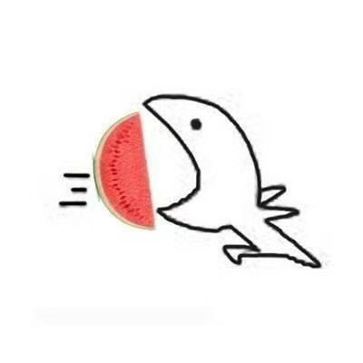 <b>徐梦阳</b></a></td>
        <td align="center" valign="top" width="11.11%"><a href="javascript:void(0)" target="_blank"> <b>九月</b></a></td>
        <td align="center" valign="top" width="11.11%"><a href="javascript:void(0)" target="_blank"> <b>tangl伟</b></a></td>
        <td align="center" valign="top" width="11.11%"><a href="javascript:void(0)" target="_blank"> <b>冯瑞伦</b></a></td>
        <td align="center" valign="top" width="11.11%"><a href="javascript:void(0)" target="_blank">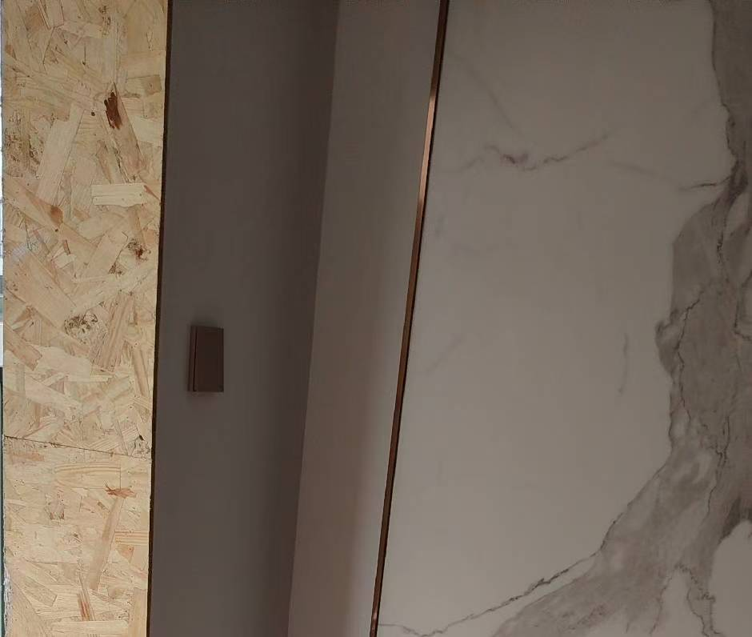 <b>杨林</b></a></td>
        <td align="center" valign="top" width="11.11%"><a href="javascript:void(0)" target="_blank"> <b>梧桐有语。</b></a></td>
        <td align="center" valign="top" width="11.11%"><a href="javascript:void(0)" target="_blank"> <b>歌德de花烛</b></a></td>
    </tr>
    <tr>
        <td align="center" valign="top" width="11.11%"><a href="javascript:void(0)" target="_blank"> <b>泥嚎</b></a></td>
        <td align="center" valign="top" width="11.11%"><a href="javascript:void(0)" target="_blank"> <b>翠翠草原</b></a></td>
        <td align="center" valign="top" width="11.11%"><a href="javascript:void(0)" target="_blank"> <b>胡泽龙</b></a></td>
        <td align="center" valign="top" width="11.11%"><a href="javascript:void(0)" target="_blank"> <b>苏叶</b></a></td>
        <td align="center" valign="top" width="11.11%"><a href="javascript:void(0)" target="_blank"> <b>裴先生</b></a></td>
        <td align="center" valign="top" width="11.11%"><a href="javascript:void(0)" target="_blank">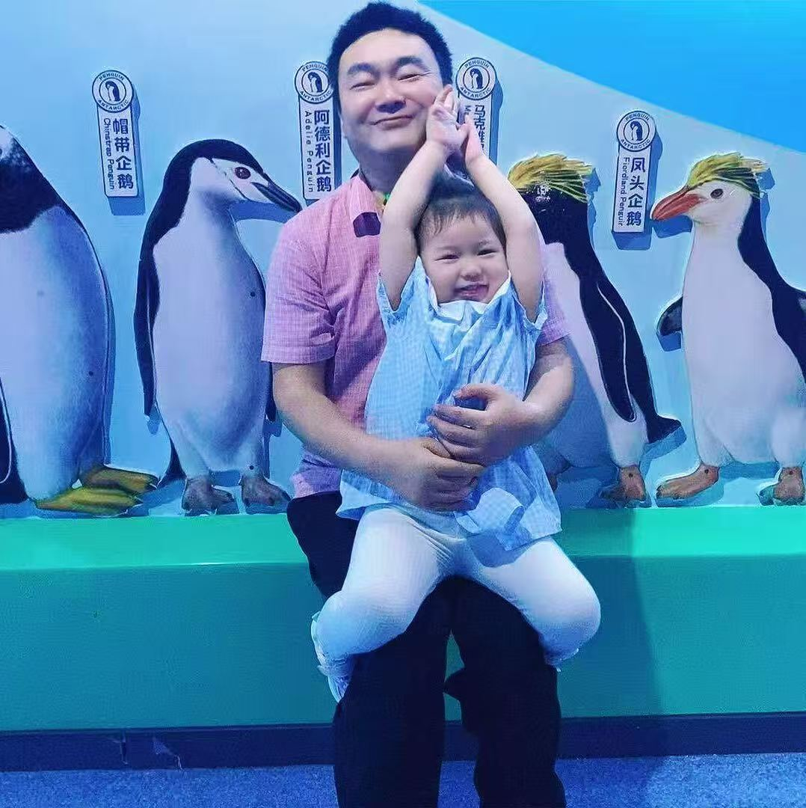 <b>谭远彪</b></a></td>
        <td align="center" valign="top" width="11.11%"><a href="javascript:void(0)" target="_blank"> <b>陈祺</b></a></td>
        <td align="center" valign="top" width="11.11%"><a href="javascript:void(0)" target="_blank"> <b>零点就睡</b></a></td>
        <td align="center" valign="top" width="11.11%"><a href="javascript:void(0)" target="_blank"> <b>风之羽</b></a></td>
    </tr>
    <tr>
        <td align="center" valign="top" width="11.11%"><a href="https://gitee.com/fufeng1908" target="_blank"> <b>王守仁</b></a></td>
        <td align="center" valign="top" width="11.11%"><a href="https://gitee.com/kaigejava" target="_blank"> <b>狼图腾</b></a></td>
        <td align="center" valign="top" width="11.11%"><a href="javascript:void(0)" target="_blank"> <b>马到成功</b></a></td>
        <td align="center" valign="top" width="11.11%"><a href="javascript:void(0)" target="_blank"> <b>做生活的高手</b></a></td>
        <td align="center" valign="top" width="11.11%"><a href="javascript:void(0)" target="_blank"> <b>清欢之恋</b></a></td>
        <td align="center" valign="top" width="11.11%"><a href="javascript:void(0)" target="_blank"> <b>绝域时空</b></a></td>
        <td align="center" valign="top" width="11.11%"><a href="javascript:void(0)" target="_blank"> <b>风雨</b></a></td>
        <td align="center" valign="top" width="11.11%"><a href="javascript:void(0)" target="_blank"> <b>Nicola</b></a></td>
        <td align="center" valign="top" width="11.11%"><a href="javascript:void(0)" target="_blank"> <b>云住</b></a></td>
    </tr>
    <tr>
        <td align="center" valign="top" width="11.11%"><a href="javascript:void(0)" target="_blank"> <b>Mr.Zhang</b></a></td>
        <td align="center" valign="top" width="11.11%"><a href="javascript:void(0)" target="_blank"> <b>剑</b></a></td>
        <td align="center" valign="top" width="11.11%"><a href="javascript:void(0)" target="_blank"> <b>shen</b></a></td>
        <td align="center" valign="top" width="11.11%"><a href="javascript:void(0)" target="_blank"> <b>嗯</b></a></td>
        <td align="center" valign="top" width="11.11%"><a href="javascript:void(0)" target="_blank"> <b>周华</b></a></td>
        <td align="center" valign="top" width="11.11%"><a href="javascript:void(0)" target="_blank"> <b>太阳鸟</b></a></td>
        <td align="center" valign="top" width="11.11%"><a href="javascript:void(0)" target="_blank"> <b>了了</b></a></td>
        <td align="center" valign="top" width="11.11%"><a href="javascript:void(0)" target="_blank"> <b>第七次日落</b></a></td>
        <td align="center" valign="top" width="11.11%"><a href="javascript:void(0)" target="_blank"> <b>npc</b></a></td>
    </tr>
    <tr>
        <td align="center" valign="top" width="11.11%"><a href="javascript:void(0)" target="_blank"> <b>承担不一样的天空</b></a></td>
        <td align="center" valign="top" width="11.11%"><a href="javascript:void(0)" target="_blank"> <b>铁木</b></a></td>
        <td align="center" valign="top" width="11.11%"><a href="javascript:void(0)" target="_blank"> <b>Orion</b></a></td>
        <td align="center" valign="top" width="11.11%"><a href="javascript:void(0)" target="_blank"> <b>森源-金福洪</b></a></td>
        <td align="center" valign="top" width="11.11%"><a href="javascript:void(0)" target="_blank"> <b>薛继超</b></a></td>
        <td align="center" valign="top" width="11.11%"><a href="javascript:void(0)" target="_blank"> <b>虎虎虎</b></a></td>
        <td align="center" valign="top" width="11.11%"><a href="javascript:void(0)" target="_blank"> <b>Everyman</b></a></td>
        <td align="center" valign="top" width="11.11%"><a href="javascript:void(0)" target="_blank"> <b>NXL</b></a></td>
        <td align="center" valign="top" width="11.11%"><a href="javascript:void(0)" target="_blank"> <b>孙涛</b></a></td>
    </tr>
    <tr>
        <td align="center" valign="top" width="11.11%"><a href="javascript:void(0)" target="_blank"> <b>hrsjw1</b></a></td>
        <td align="center" valign="top" width="11.11%"><a href="javascript:void(0)" target="_blank"> <b>linguanghuan</b></a></td>
        <td align="center" valign="top" width="11.11%"><a href="javascript:void(0)" target="_blank"> <b>YiYaYiYaho</b></a></td>
        <td align="center" valign="top" width="11.11%"><a href="javascript:void(0)" target="_blank"> <b>慢慢慢</b></a></td>
        <td align="center" valign="top" width="11.11%"><a href="javascript:void(0)" target="_blank"> <b>lilOne</b></a></td>
    </tr>
  </tbody>
</table>

## 💡 Пожелания

Добро пожаловать с предложениями по улучшению, которые помогут усовершенствовать easyaiot.

## 📄 Авторские права

翱翔的雄库鲁/easyaiot использует лицензию с открытым исходным кодом <a href="https://gitee.com/soaring-xiongkulu/easyaiot/blob/main/LICENSE" style="color: #3498db; text-decoration: none; font-weight: 600;">MIT LICENSE</a>. Мы стремимся способствовать популяризации и развитию технологий ИИ, позволяя большему количеству людей свободно использовать и получать выгоду от этой технологии.

<strong>Лицензия на использование</strong>: Физические лица и предприятия могут использовать его на 100% бесплатно, без необходимости сохранять информацию об авторе или авторских правах. Мы верим, что ценность технологии заключается в её широком использовании и непрерывном инновационном развитии, а не в ограничениях авторского права. Мы надеемся, что вы сможете свободно использовать, изменять и распространять этот проект, делая технологии ИИ действительно полезными для каждого.

## 🌟 График роста звезд (Star)

